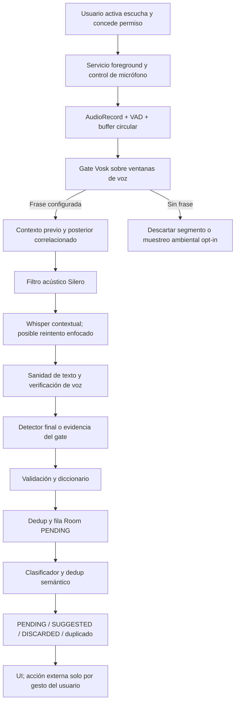
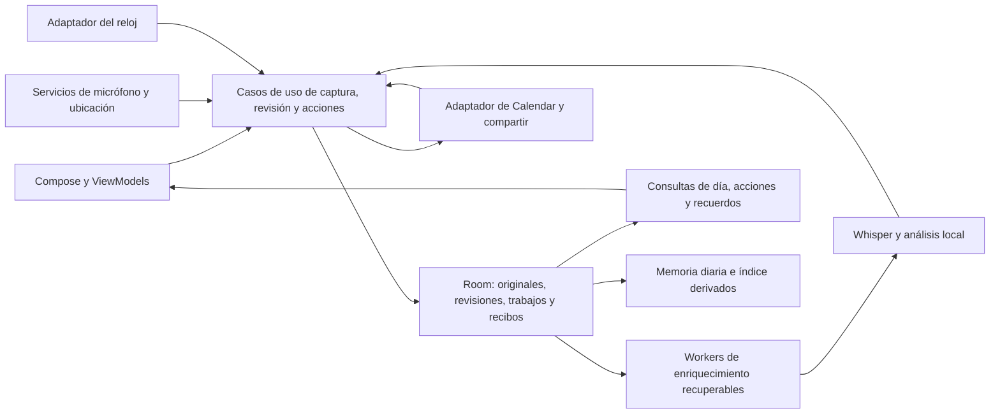
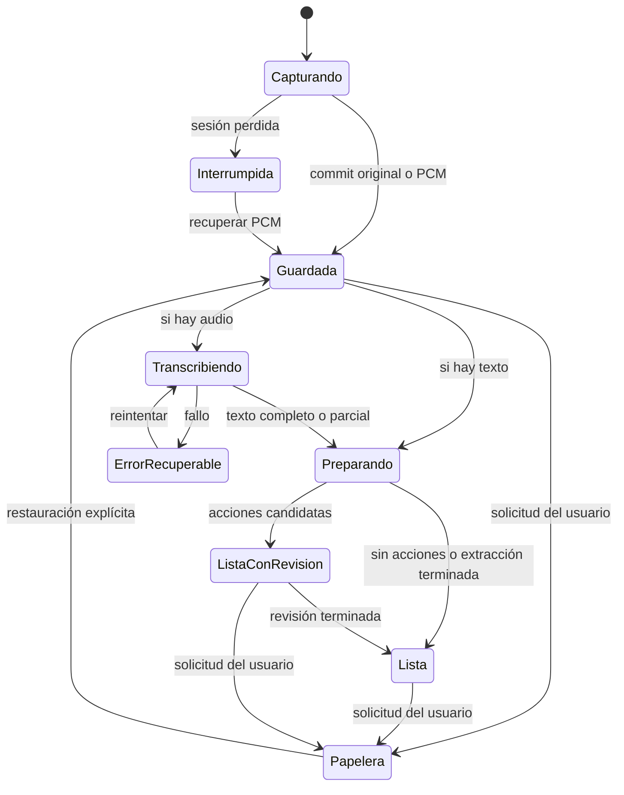

# Auditoría de producto, UX y arquitectura de Trama

**Fecha:** 12 de septiembre de 2026. **Estado:** propuesta para aprobación; sin implementar.

**Validación:** 634 pruebas unitarias superadas en móvil, shared y reloj; cero fallos. Se han comprobado 227 referencias a archivos y líneas. El [registro de evidencia](</Users/pabmon/Documents/Projects/TRAMA/Trama/docs/audit-2026-09-12/EVIDENCIA.json>) incluye el comando ejecutado, resultados por módulo y huellas de los archivos citados.

**Base examinada:** el árbol de trabajo actual de `/Users/pabmon/Documents/Projects/TRAMA/Trama`, incluidos sus cambios sin commit. No se ha auditado únicamente HEAD. El proyecto contiene aproximadamente 42.813 líneas Kotlin propias en producción, entre móvil, shared y reloj. Las referencias corresponden a esta versión y pueden desplazarse con cambios posteriores.

Se han seguido las rutas de navegación, los escritores y lectores de datos, captura automática y manual, procesamiento de reuniones, lugares, Calendar, búsqueda, chat, sincronización, recuperación y tests. La documentación previa se ha usado como contexto; cuando contradice el código, prevalece el código. No se han leído los backups privados ni se han extraído datos del móvil. No se ha instalado, desplegado ni modificado la aplicación. Este documento y su evidencia de pruebas son los únicos entregables nuevos.

**Grado de evidencia:** **D** = comportamiento o contradicción demostrable por lectura del código; no significa reproducción física. **H** = riesgo con una secuencia causal concreta, pendiente de reproducción. **P** = decisión de producto propuesta. La UX visual se evalúa por composición, jerarquía y navegación declaradas; no hay verificación en pantalla real de contraste, recortes, TalkBack, rendimiento o consumo. No se atribuyen a los usuarios resultados de investigación que no se ha realizado.

## A. Diagnóstico ejecutivo: los cinco problemas más graves

### 1. Guardar un recuerdo no garantiza conservarlo como recuerdo

**D.** La captura manual se guarda con categoría «Nota», pero nace como `PENDING` y entra inmediatamente en el mismo clasificador de tareas que la escucha automática. No existe una entidad o un tipo de contenido persistido que proteja notas y recomendaciones. El procesador puede descartarla por ruido, aprendizaje o falta de utilidad accionable. `isManual` no impide ese descarte. Una nota no accionable puede permanecer como tarea sin modelo o acabar oculta dependiendo del resultado de clasificación.

Evidencia: [SaveManualCapture.kt:17](/Users/pabmon/Documents/Projects/TRAMA/Trama/app/src/main/java/com/trama/app/capture/SaveManualCapture.kt:17), [CalendarViewModel.kt:115](/Users/pabmon/Documents/Projects/TRAMA/Trama/app/src/main/java/com/trama/app/ui/screens/CalendarViewModel.kt:115), [ActionItemProcessor.kt:32](/Users/pabmon/Documents/Projects/TRAMA/Trama/app/src/main/java/com/trama/app/summary/ActionItemProcessor.kt:32), [ActionItemProcessor.kt:937](/Users/pabmon/Documents/Projects/TRAMA/Trama/app/src/main/java/com/trama/app/summary/ActionItemProcessor.kt:937). Los descartes desaparecen del diario y de búsqueda: [DiaryDao.kt:59](/Users/pabmon/Documents/Projects/TRAMA/Trama/shared/src/main/java/com/trama/shared/data/DiaryDao.kt:59), [DiaryDao.kt:102](/Users/pabmon/Documents/Projects/TRAMA/Trama/shared/src/main/java/com/trama/shared/data/DiaryDao.kt:102).

**Consecuencia:** «Guardar» significa guardar antes de que otra capa decida si debe seguir viéndose. Esto contradice el propósito de memoria personal. **Prioridad P0, cambios C01 y C02.**

### 2. La decisión humana no tiene una protección universal frente al procesamiento

**D.** `markSuggested`, `confirmSuggested`, `markPending` y los updates de IA no condicionan su escritura al estado previo ni a una revisión. El procesador no comprueba que un elemento esté descartado o confirmado antes de modificarlo. **H.** Una edición que dispara procesamiento, seguida de un descarte mientras se espera al modelo, puede terminar con `routeRejected → markSuggested` y devolverlo a revisión. También pueden aparecer acciones hijas después de descartar su origen.

Evidencia: [DiaryDao.kt:156](/Users/pabmon/Documents/Projects/TRAMA/Trama/shared/src/main/java/com/trama/shared/data/DiaryDao.kt:156), [DiaryDao.kt:175](/Users/pabmon/Documents/Projects/TRAMA/Trama/shared/src/main/java/com/trama/shared/data/DiaryDao.kt:175), [EntryEditorViewModel.kt:59](/Users/pabmon/Documents/Projects/TRAMA/Trama/app/src/main/java/com/trama/app/ui/screens/EntryEditorViewModel.kt:59), [ActionItemProcessor.kt:937](/Users/pabmon/Documents/Projects/TRAMA/Trama/app/src/main/java/com/trama/app/summary/ActionItemProcessor.kt:937), [ActionItemProcessor.kt:1097](/Users/pabmon/Documents/Projects/TRAMA/Trama/app/src/main/java/com/trama/app/summary/ActionItemProcessor.kt:1097).

**Matiz esencial:** el descarte específico de duplicados **ya** es una actualización atómica y deja constancia humana; no es correcto diagnosticar como vigente su antiguo borrado del enlace sin descartar. Falta extender esa garantía al resto del sistema. [DiaryDao.kt:211](/Users/pabmon/Documents/Projects/TRAMA/Trama/shared/src/main/java/com/trama/shared/data/DiaryDao.kt:211). **P0, C02 y C03.**

### 3. Una misma acción externa tiene resultados distintos según la pantalla

**D.** Desde Detalle, insertar un evento marca la tarea como completada. Desde las tarjetas del día y otras pendientes, la misma inserción deja la tarea pendiente. Programar una llamada futura no significa haberla realizado. Además, `SEND` y `TALK_TO` abren compartir un mensaje incluso si hay fecha futura.

Evidencia: [EntryDetailScreen.kt:437](/Users/pabmon/Documents/Projects/TRAMA/Trama/app/src/main/java/com/trama/app/ui/screens/EntryDetailScreen.kt:437), [TimelineSupport.kt:402](/Users/pabmon/Documents/Projects/TRAMA/Trama/app/src/main/java/com/trama/app/ui/screens/TimelineSupport.kt:402), [CalendarScreen.kt:1272](/Users/pabmon/Documents/Projects/TRAMA/Trama/app/src/main/java/com/trama/app/ui/screens/CalendarScreen.kt:1272), [EntryActionBridge.kt:58](/Users/pabmon/Documents/Projects/TRAMA/Trama/app/src/main/java/com/trama/app/summary/EntryActionBridge.kt:58).

**Mejora ya presente:** `CALL` ahora crea un recordatorio, no abre el teléfono. El recordatorio real es un **evento del proveedor Calendar con aviso**, no una tarea de Google Tasks. La inserción evento+aviso usa `applyBatch`. Aun así, falta una identidad persistida de la acción externa y su resultado. **P0, C04 y C05.**

### 4. El trigger se respeta al transcribir, pero no hasta el final del guardado

**D.** El gate móvil usa únicamente frases configuradas, conserva la detección correlacionada y puede rescatarla aunque Whisper omita el trigger. Sin embargo, después `ActionItemProcessor` puede descartar por criterios semánticos. La evidencia del trigger no se guarda como un contrato verificable en Room. La clasificación sigue decidiendo la existencia visible de la captura.

Evidencia: [IntentDetector.kt:100](/Users/pabmon/Documents/Projects/TRAMA/Trama/shared/src/main/java/com/trama/shared/speech/IntentDetector.kt:100), [KeywordListenerService.kt:1068](/Users/pabmon/Documents/Projects/TRAMA/Trama/app/src/main/java/com/trama/app/service/KeywordListenerService.kt:1068), [KeywordListenerService.kt:1258](/Users/pabmon/Documents/Projects/TRAMA/Trama/app/src/main/java/com/trama/app/service/KeywordListenerService.kt:1258), [CaptureSaver.kt:112](/Users/pabmon/Documents/Projects/TRAMA/Trama/app/src/main/java/com/trama/app/service/CaptureSaver.kt:112).

**Consecuencia:** el usuario configura una frase y no puede prever si lo capturado será nota, tarea, revisión o descarte invisible. **P0, C01 y C06.**

### 5. Los controles y mensajes de privacidad/recuperación cubren menos de lo que parecen

**D.** Desactivar «Aprender de mis decisiones» limita escrituras de feedback en la UI, pero el procesador sigue leyendo señales antiguas. Los logs persistentes contienen textos aunque el diagnóstico visible esté apagado. El backup no incorpora audio. El borrado de reuniones desde Home elimina la fila pero no su PCM, a diferencia de otras pantallas. La resolución de lugares envía coordenadas a servicios externos.

Evidencia: [SettingsScreen.kt:1830](/Users/pabmon/Documents/Projects/TRAMA/Trama/app/src/main/java/com/trama/app/ui/screens/SettingsScreen.kt:1830), [ActionItemProcessor.kt:81](/Users/pabmon/Documents/Projects/TRAMA/Trama/app/src/main/java/com/trama/app/summary/ActionItemProcessor.kt:81), [DeletionFeedbackStore.kt:234](/Users/pabmon/Documents/Projects/TRAMA/Trama/app/src/main/java/com/trama/app/summary/DeletionFeedbackStore.kt:234), [CaptureLog.kt:91](/Users/pabmon/Documents/Projects/TRAMA/Trama/app/src/main/java/com/trama/app/diagnostics/CaptureLog.kt:91), [BackupManager.kt:70](/Users/pabmon/Documents/Projects/TRAMA/Trama/app/src/main/java/com/trama/app/backup/BackupManager.kt:70), [CalendarEntryActions.kt:20](/Users/pabmon/Documents/Projects/TRAMA/Trama/app/src/main/java/com/trama/app/capture/CalendarEntryActions.kt:20), [PlaceResolver.kt:73](/Users/pabmon/Documents/Projects/TRAMA/Trama/app/src/main/java/com/trama/app/location/PlaceResolver.kt:73).

**Consecuencia:** el control aparente no coincide con el tratamiento efectivo de los datos. La prioridad es corregir contratos y transparencia, no añadir más interruptores técnicos. **P0/P1, C07–C10.**

## B. Mapa funcional real

### B1. Qué persiste y qué representa

Room está en **versión 17**, con seis entidades y cadena de migraciones explícita; el README que indica versión 16 está desactualizado. [DiaryDatabase.kt:15](/Users/pabmon/Documents/Projects/TRAMA/Trama/shared/src/main/java/com/trama/shared/data/DiaryDatabase.kt:15), [DatabaseProvider.kt:25](/Users/pabmon/Documents/Projects/TRAMA/Trama/shared/src/main/java/com/trama/shared/data/DatabaseProvider.kt:25).

| Dato | Contenido y autoridad real | Cómo aparece / límite |
|---|---|---|
| `DiaryEntry` | Texto original, corregido y limpio; categoría/keyword; confianza ASR/modelo; tipo de acción; fecha; estado; duplicado; reunión de origen; confirmación humana | Nota y tarea comparten fila. `displayText` prioriza `cleanText`, después texto original; no usa directamente `correctedText`. `duplicateOfId` es un indicador adicional, no un estado. [DiaryEntry.kt:8](/Users/pabmon/Documents/Projects/TRAMA/Trama/shared/src/main/java/com/trama/shared/model/DiaryEntry.kt:8) |
| `Recording` | Transcripción plana, título, resumen, puntos JSON, duración, origen, estado, ruta PCM, frecuencia de muestreo | No hay segmentos de hablante ni marcas temporales de transcripción. Un resultado «solo transcripción» usa también `COMPLETED`. [Recording.kt:7](/Users/pabmon/Documents/Projects/TRAMA/Trama/shared/src/main/java/com/trama/shared/model/Recording.kt:7) |
| `TimelineEvent` | Visita, evento Calendar o bloque ambiental; intervalo, título, lugar, JSON de procedencia, marca de completado | Calendario es una proyección importada; las tareas/grabaciones se unen en UI, no se copian todas a esta tabla. [TimelineEvent.kt:15](/Users/pabmon/Documents/Projects/TRAMA/Trama/shared/src/main/java/com/trama/shared/model/TimelineEvent.kt:15), [TimelineSupport.kt:97](/Users/pabmon/Documents/Projects/TRAMA/Trama/app/src/main/java/com/trama/app/ui/screens/TimelineSupport.kt:97) |
| `Place` | Coordenadas, nombre/contexto geográfico, visitas agregadas, una valoración/opinión/resumen actuales, Casa/Trabajo | La opinión es global al lugar, no una opinión histórica por visita. No representa un restaurante recomendado aún no visitado sin forzar datos geográficos. [Place.kt:15](/Users/pabmon/Documents/Projects/TRAMA/Trama/shared/src/main/java/com/trama/shared/model/Place.kt:15) |
| `DwellDetectionState` | Candidato, ancla, tiempos de estancia y último cierre | Estado de recuperación del detector, separado de las visitas visibles. [DwellDetectionState.kt:1](/Users/pabmon/Documents/Projects/TRAMA/Trama/shared/src/main/java/com/trama/shared/model/DwellDetectionState.kt:1) |
| `DailyPage` | Resumen, insights y Markdown por fecha, ruta privada y marcas de revisión | Memoria derivada en Room más copia en archivo. No constituye una fuente independiente fiable de verdad si se editan/borran los datos originales. [DailyPage.kt:7](/Users/pabmon/Documents/Projects/TRAMA/Trama/shared/src/main/java/com/trama/shared/model/DailyPage.kt:7) |

**Fuera de Room:** DataStore de ajustes; preferencias de servicio y suspensión; preferencias del modelo local, perfil de voz y destino de backup; diccionario de correcciones; feedback positivo/negativo JSON; PCM de reuniones; archivos/estado de transferencia del reloj; logs JSONL; Markdown privado. Los estados de procesamiento de capturas, borrados optimistas y gran parte de los borradores viven en memoria/UI.

No hay una entidad propia de recomendación, lista de compra con ítems, acción externa con recibo, papelera completa, revisión versionada ni segmento diarizado. No se deben presentar esas capacidades como terminadas.

### B2. Qué decide cada capa

| Capa | Decisión real | Problema de frontera |
|---|---|---|
| Servicio y coordinador de micrófono | Si se escucha/graba, preferencias, reloj, permisos, batería, temperatura y audio reproducido | Preferencia deseada y estado efectivo son distintos; existen varios StateFlow/preferencias |
| VAD + buffer + gate ligero | Apertura/cierre de segmentos, ventanas, detección de frase | Correlación de resultados asíncronos ya explícita; aún no persistida con la captura |
| Whisper | Transcripción contextual; reintento enfocado cuando no encuentra frase | Puede devolver vacío; no hay un elemento recuperable para todo fallo de captura automática |
| Speaker verification | Filtra voz ajena o manda casos inciertos a revisión | Es posterior a transcribir; no equivale a diarización |
| Detector/configuración | Coincidencia de frase, confianza y etiqueta | Se vuelve a consultar la configuración actual al rescatar el gate, no una versión inmutable |
| Validator/diccionario | Corrección del texto | Puede gastar modelo antes de que exista una fila durable |
| `ActionItemProcessor` | Limpia, fecha, prioridad, divide, acepta, sugiere, descarta y deduplica | Una capa de enriquecimiento controla también el ciclo de vida y crea filas nuevas |
| Room/Repository | CRUD y algunas transacciones | No impone invariantes universales ni restricciones de transición |
| Compose/ViewModels | Consultas, filtros, deshacer, edición y parte de efectos externos | Patrones de escritura y de éxito distintos según pantalla |
| Calendar/Intents | Inserción o apertura de otra app | No existe recibo durable que distinga guardado verificado de editor abierto |

DI no crea una segunda Room: Hilt devuelve la instancia de `DatabaseProvider`. La duplicidad es de acceso y responsabilidades, no una prueba de dos bases móviles. [AppModule.kt:21](/Users/pabmon/Documents/Projects/TRAMA/Trama/app/src/main/java/com/trama/app/di/AppModule.kt:21).

### B3. Flujos actuales, con salida y fallos

#### Escucha continua móvil



El contexto predeterminado es 5 s previos y hasta 10 s posteriores; no es grabación ilimitada. El primario conserva contexto hasta el máximo del servicio; `forFinalAsr` recorta para un reintento, no para toda transcripción. Los segmentos sin trigger rotan y el motor aplica reducción de evaluaciones ante ruido/carga. [SettingsDataStore.kt:97](/Users/pabmon/Documents/Projects/TRAMA/Trama/app/src/main/java/com/trama/app/ui/SettingsDataStore.kt:97), [KeywordListenerService.kt:812](/Users/pabmon/Documents/Projects/TRAMA/Trama/app/src/main/java/com/trama/app/service/KeywordListenerService.kt:812), [ContextualAudioCaptureEngine.kt:276](/Users/pabmon/Documents/Projects/TRAMA/Trama/app/src/main/java/com/trama/app/audio/ContextualAudioCaptureEngine.kt:276).

Sin frase no se promueve la hipótesis de Whisper a tarea desde muestreo ambiental. Esto ya está separado. Si falla ASR/voz, el resultado puede quedarse en diagnóstico, sin fila visible. La captura automática vive en RAM hasta su guardado; matar el proceso en esa fase pierde esa ventana. Tras insertar, el procesamiento depende de coroutines del servicio, no de una cola persistida de capturas. [KeywordListenerService.kt:969](/Users/pabmon/Documents/Projects/TRAMA/Trama/app/src/main/java/com/trama/app/service/KeywordListenerService.kt:969), [KeywordListenerService.kt:1347](/Users/pabmon/Documents/Projects/TRAMA/Trama/app/src/main/java/com/trama/app/service/KeywordListenerService.kt:1347), [CaptureSaver.kt:46](/Users/pabmon/Documents/Projects/TRAMA/Trama/app/src/main/java/com/trama/app/service/CaptureSaver.kt:46).

#### Captura manual y contenido compartido

```text
Home → Añadir → escribir / dictar offline → borrador → Guardar
  → transacción: recuperar misma captura ya guardada o insertar
  → cerrar diálogo y reconocer guardado
  → procesamiento en ViewModel → mismos estados que una tarea automática

Compartir texto → SharedContentWorker → insertar isManual → ActionItemProcessor
Compartir audio → decodificar todo → una llamada ASR → Recording → análisis
Compartir imagen → worker de visión local → sugerencias → notificación
```

El borrador manual utiliza `SavedStateHandle`, conserva texto ante error e identifica un guardado previo por fecha+texto. Es un avance real. No protege la nota del descarte posterior ni completa automáticamente la clasificación tras muerte del proceso. [CalendarViewModel.kt:61](/Users/pabmon/Documents/Projects/TRAMA/Trama/app/src/main/java/com/trama/app/ui/screens/CalendarViewModel.kt:61).

Las importaciones de audio no usan el transcriptor por bloques de reuniones. La pérdida de contenido de audios largos es un **riesgo a reproducir**, no una grabación escuchada en esta auditoría. El reintento de compartir texto puede reinsertar antes de volver a clasificar. [SharedContentWorker.kt:31](/Users/pabmon/Documents/Projects/TRAMA/Trama/app/src/main/java/com/trama/app/share/SharedContentWorker.kt:31).

#### Reuniones

```text
Micrófono Home → iniciar grabación → pausar escucha automática
  → crear Recording CAPTURING + PCM .part
  → detener / límite → finalizar PCM → TRANSCRIBING + WorkManager KEEP
  → transcribir bloques de 25 s → concatenar texto → PENDING
  → worker de análisis → PROCESSING
  → modelo local: título + resumen + puntos + acciones SUGGESTED
     o fallback: transcripción como resumen, sin acciones
  → transacción resultado+acciones → COMPLETED
  → revisión humana de acciones → pendientes → Calendar / completar
```

La transcripción conserva partes válidas y omite bloques rechazados; el resultado final no persiste un mapa de huecos ni de hablantes. No hay pipeline de diarización usado por la app, aunque el repositorio incluya bindings de sherpa que ofrecen esa capacidad. [PcmRecordingTranscriber.kt:42](/Users/pabmon/Documents/Projects/TRAMA/Trama/app/src/main/java/com/trama/app/audio/PcmRecordingTranscriber.kt:42), [RecordingProcessor.kt:321](/Users/pabmon/Documents/Projects/TRAMA/Trama/app/src/main/java/com/trama/app/summary/RecordingProcessor.kt:321).

`TRANSCRIPT_ONLY` es visible como «Transcripción local sin analizar», pero está en `COMPLETED` y el botón de procesar solo aparece en `FAILED/PENDING`. Descargar después el modelo no ofrece una ruta visible para analizar esa reunión terminada. [RecordingDetailScreen.kt:193](/Users/pabmon/Documents/Projects/TRAMA/Trama/app/src/main/java/com/trama/app/ui/screens/RecordingDetailScreen.kt:193), [RecordingDetailScreen.kt:525](/Users/pabmon/Documents/Projects/TRAMA/Trama/app/src/main/java/com/trama/app/ui/screens/RecordingDetailScreen.kt:525).

#### Lugares

```text
Activar lugares y permisos → GPS/red → DwellDetector con histéresis
  → persistir estado → estancia confirmada → lugar local provisional + visita visible
  → enriquecimiento remoto de nombre/dirección → actualizar visita
  → salir → cerrar intervalo (dividir entre días si procede)
  → día / búsqueda → ficha → nombre, valoración, opinión, Casa/Trabajo, mapa
  → editar visita mediante SaveVisit (intervalos validados)
```

No se guarda una ruta GPS completa: se guardan estancias. «Dónde he estado» es una aproximación por permanencia, no una reconstrucción de cada paso. El nombre se infiere por proximidad; dos negocios a menos de 80 m pueden confundirse. El servidor Overpass recibe una consulta con `out center 1`, por lo que elegir después el elemento más cercano no garantiza que se hayan recibido todos los candidatos. [LocationForegroundService.kt:159](/Users/pabmon/Documents/Projects/TRAMA/Trama/app/src/main/java/com/trama/app/service/LocationForegroundService.kt:159), [PlaceResolver.kt:60](/Users/pabmon/Documents/Projects/TRAMA/Trama/app/src/main/java/com/trama/app/location/PlaceResolver.kt:60), [SaveVisit.kt:13](/Users/pabmon/Documents/Projects/TRAMA/Trama/app/src/main/java/com/trama/app/capture/SaveVisit.kt:13).

#### Sugerencias, duplicados y descartes

```text
Clasificador / reunión / imagen → SUGGESTED
  → Home «Por revisar» / Detalle / reunión → Añadir a pendientes
  → confirmSuggested guarda fecha y origen humano → PENDING
  → Descartar → DISCARDED → se oculta en consultas normales
  → Deshacer en Home → SUGGESTED

Duplicado PENDING → revisión de duplicados
  → «No es duplicado»: solo elimina duplicateOfId
  → «Eliminar»: discardDuplicate, marca terminal y elimina enlace
```

`getPending` incluye sugerencias; `getDuplicates` solo incluye duplicados pendientes. Una sugerencia marcada duplicada sale del listado global de sugerencias y no entra en duplicados globales, aunque aún puede verse desde su reunión. El estado de revisión no es uniforme entre superficies. [DiaryDao.kt:22](/Users/pabmon/Documents/Projects/TRAMA/Trama/shared/src/main/java/com/trama/shared/data/DiaryDao.kt:22), [DiaryDao.kt:218](/Users/pabmon/Documents/Projects/TRAMA/Trama/shared/src/main/java/com/trama/shared/data/DiaryDao.kt:218), [RecordingDetailScreen.kt:322](/Users/pabmon/Documents/Projects/TRAMA/Trama/app/src/main/java/com/trama/app/ui/screens/RecordingDetailScreen.kt:322).

**Procesos capaces de reintroducir contenido:** clasificación posterior a edición/captura; creación de acciones hijas; reextracción de reuniones tras borrar físicamente acciones (el descarte conservado sí protege coincidencias exactas); reimportación de calendario tras borrar su proyección local; replay de datos del reloj tras borrado físico; importación de backup. Los últimos dos replays y las carreras se deben reproducir. La importación solicitada de un backup es deliberada, pero debe explicar su efecto; no es equivalente a una resurrección espontánea.

#### Acciones externas

```text
PENDING → EntryActionBridge → previsualización Calendar / Intent de compartir
  CALL → REMINDER → evento con aviso (15 min antes)
  EVENT → CALENDAR_EVENT → evento (por defecto 1 h)
  BUY sin fecha → texto compartido a Keep u otra app de notas
  BUY/GENERIC/REVIEW con fecha → recordatorio o evento por heurística
  SEND/TALK_TO → compartir texto como mensaje, incluso con fecha
  GENERIC/REVIEW sin fecha → no acción externa rápida
```

Keep recibe texto; no hay integración de checklist estructurada ni confirmación de guardado. Mensaje abre selector; no envía directamente ni resuelve un contacto verificado. `ActionExecutor.CALL` existe pero abre contactos; la ruta rápida de llamadas ya no lo usa. [EntryActionBridge.kt:24](/Users/pabmon/Documents/Projects/TRAMA/Trama/app/src/main/java/com/trama/app/summary/EntryActionBridge.kt:24), [ActionExecutor.kt:183](/Users/pabmon/Documents/Projects/TRAMA/Trama/app/src/main/java/com/trama/app/summary/ActionExecutor.kt:183).

#### Búsqueda y chat

```text
Home → Buscar → al menos 2 caracteres → consultas de texto intersectadas
  → entradas + lugares + grabaciones → abrir origen
  → Preguntar → pantalla nueva de chat (no transmite la consulta escrita)
  → interpretar intención/fecha/lugar → recuperar hechos de Room
  → respuesta determinista → opcionalmente redactar con Gemma
  → respuesta + hasta 6 enlaces de origen
```

No es un asistente ejecutor ni una conversación general. El historial está en `remember` y se pierde al recrear la pantalla. El modelo puede reformular una respuesta fundamentada, pero el código solo valida que no esté vacía: el prompt no demuestra fidelidad factual. [SearchScreen.kt:92](/Users/pabmon/Documents/Projects/TRAMA/Trama/app/src/main/java/com/trama/app/ui/screens/SearchScreen.kt:92), [NavGraph.kt:128](/Users/pabmon/Documents/Projects/TRAMA/Trama/app/src/main/java/com/trama/app/ui/NavGraph.kt:128), [DiaryAssistant.kt:49](/Users/pabmon/Documents/Projects/TRAMA/Trama/app/src/main/java/com/trama/app/chat/DiaryAssistant.kt:49), [DiaryAssistant.kt:145](/Users/pabmon/Documents/Projects/TRAMA/Trama/app/src/main/java/com/trama/app/chat/DiaryAssistant.kt:145), [ChatScreen.kt:97](/Users/pabmon/Documents/Projects/TRAMA/Trama/app/src/main/java/com/trama/app/ui/screens/ChatScreen.kt:97).

#### Recuperación y reloj

```text
Abrir móvil / reiniciar → RecoveryWorker → filas CAPTURING/TRANSCRIBING
  → finalizar PCM existente → encolar transcripción; si no hay PCM → FAILED
Reinicio → restaurar horarios + avisar para reactivar micrófono según preferencia
  → ubicación solo con permisos necesarios
Reloj → gate local → contexto PCM → teléfono → Whisper → entrada
Reloj → reunión PCM durable → Asset + tamaño/hash → móvil guarda/fsync
  → recibo → reloj puede liberar archivo
```

El reloj prioriza **Sherpa gate y después Vosk**, mientras el móvil crea Vosk. El README que dice Vosk compartido como única ruta vigente no describe este detalle. La recepción de captura contextual usa detector nuevo con defaults, no el mismo detector configurado del móvil, y puede usar texto del trigger si no hay transcripción final. Debe conservarse esa procedencia como calidad degradada. [WatchKeywordListenerService.kt:587](/Users/pabmon/Documents/Projects/TRAMA/Trama/wear/src/main/java/com/trama/wear/service/WatchKeywordListenerService.kt:587), [WatchDataReceiverService.kt:472](/Users/pabmon/Documents/Projects/TRAMA/Trama/app/src/main/java/com/trama/app/sync/WatchDataReceiverService.kt:472).

La sincronización del diario teléfono→reloj es expresamente un **no-op**; el reloj solo tiene Home en su navegación. No hay sincronización bidireccional completa de recuerdos. Sí existen ajustes, coordinación del micrófono y transferencia de audio. [PhoneToWatchSyncer.kt:8](/Users/pabmon/Documents/Projects/TRAMA/Trama/app/src/main/java/com/trama/app/sync/PhoneToWatchSyncer.kt:8), [WatchNavGraph.kt:9](/Users/pabmon/Documents/Projects/TRAMA/Trama/wear/src/main/java/com/trama/wear/ui/WatchNavGraph.kt:9).

## C. Inventario de pantallas, controles y estados

Las acciones siguientes se han seguido hasta su callback, DAO, worker o Intent. «Alcanzable» significa conexión en código, no certificación en dispositivo.

| Superficie actual | Controles / resultado alcanzable | Decisión y problema | Cambio |
|---|---|---|---|
| Home = CalendarScreen | Buscar, Añadir, menú Grabaciones/Ajustes; fecha anterior/siguiente, Hoy, selector de mes | Mantener el día como entrada; simplificar accesos. No hay Home independiente | C11 |
| Home: micrófono flotante | Control de escucha; acciones secundarias de grabar y transferir al reloj | Modificar: el icono de micrófono mezcla control continuo y grabación; no representa el mismo «Añadir» de la cabecera | C06/C11 |
| Home: compromisos | Vista previa + acceso Agenda; tarjetas de tarea/evento | Mantener una vista breve; distinguir fecha programada de fecha capturada | C04/C11 |
| Home: Por revisar | Expandir; abrir; añadir a pendientes; descartar; duplicado: eliminar/no es duplicado | Fusionar en un único patrón de revisión con procedencia y comparación. Deshacer no es uniforme | C02/C03/C12 |
| Home: tareas del día/otros días/hechas | Expandir, abrir, completar, reabrir, posponer y deshacer; acciones externas; selección y borrar | Mover trabajo pendiente a Acciones; diario conserva lo ocurrido. Eliminar expansión global de pendientes antiguos como ajuste de apariencia | C04/C11 |
| Visita del día | Abrir ficha/mapa y edición de visita según tarjeta | Mantener; nombre estimado y duración comprensibles. No vender un recorrido preciso | C10 |
| Agenda | Vencidas, esta/próxima semana, futuras, sin fecha; swipe completar/posponer; abrir tarea | Fusionar con Acciones. `getPending` mezcla sugerencias; swipe «hecha» puede en realidad confirmar | C11/C12 |
| Detalle de entrada | Editar/guardar/cancelar, compartir, eliminar; aceptar/descartar sugerencia; rápida externa; hecha/reabrir; reunión origen | Mantener un único editor; adaptar controles al contenido (nota no tiene «hecha»). Unificar éxito externo | C01/C04/C12 |
| Lista de grabaciones | Abrir; seleccionar todas; borrar selección; reprocesar fallidas/pendientes | Mover a Recuerdos→Reuniones; unificar borrado y reintento con Detalle | C08/C09 |
| Detalle de grabación | Transcripción, notas/puntos editables, acciones; procesar FAILED/PENDING; eliminar | Mantener como Reunión; separar «sin analizar», fallo y listo. Borrado navega atrás antes de confirmar commit | C08/C09/C13 |
| Ficha de lugar | Nombre y Guardar nombre; estrellas; opinión, guardar, dictar, resumir; Casa/Trabajo; visitas, añadir/editar visita y mapa | Fusionar edición en un guardado; mover coordenadas fuera del primer nivel; posponer «Resumir mi opinión» como control propio | C10/C11 |
| Buscar | Texto, limpiar, agrupación de lugares/reuniones/capturas, Preguntar | Mantener como entrada a Recuerdos; sin filtros estructurados de fecha/tipo; trasladar pregunta ya escrita al asistente | C14 |
| Chat | Ejemplos, enviar, respuestas y fuentes; volver | Secundario a búsqueda. Mantener consultas concretas, eliminar promesa de preguntas abiertas universales | C14 |
| Ajustes raíz + 5 secciones | Inventario completo en I | Modificar estructura y textos; diagnóstico no oculto hoy | C07/C15 |
| Compartir texto/audio/imágenes | Activities exportadas + workers y notificaciones | Mantener texto como núcleo secundario; unificar audio; posponer expansión de visión hasta estabilizar captura | C01/C16 |
| Wear Home | Escucha, grabación, transferencia/control de teléfono; estado, batería y permisos | Mantener como mando/capturador. No anunciar consulta/sync de diario | C17 |
| DayTimelineScreen | Composable sin destino en NavGraph | Eliminar tras comprobación de referencias y previews | C19 |
| Wear lista/detalle/ajustes | Código existente sin destino en WatchNavGraph; «Forzar sincronización» queda en pantalla inaccesible | Eliminar o archivar implementación; no reabrir destinos sin caso de producto | C19 |

Referencias de navegación: [NavGraph.kt:20](/Users/pabmon/Documents/Projects/TRAMA/Trama/app/src/main/java/com/trama/app/ui/NavGraph.kt:20). Controles Home: [CalendarScreen.kt:681](/Users/pabmon/Documents/Projects/TRAMA/Trama/app/src/main/java/com/trama/app/ui/screens/CalendarScreen.kt:681), [CalendarScreen.kt:1884](/Users/pabmon/Documents/Projects/TRAMA/Trama/app/src/main/java/com/trama/app/ui/screens/CalendarScreen.kt:1884), [CalendarScreen.kt:2003](/Users/pabmon/Documents/Projects/TRAMA/Trama/app/src/main/java/com/trama/app/ui/screens/CalendarScreen.kt:2003). Lista: [RecordingsListScreen.kt:50](/Users/pabmon/Documents/Projects/TRAMA/Trama/app/src/main/java/com/trama/app/ui/screens/RecordingsListScreen.kt:50). Ficha: [PlaceDetailScreen.kt:245](/Users/pabmon/Documents/Projects/TRAMA/Trama/app/src/main/java/com/trama/app/ui/screens/PlaceDetailScreen.kt:245).

### Estados visibles y contradicciones

| Concepto actual | Realidad | Destino propuesto |
|---|---|---|
| Pendiente | Estado por defecto de una captura, nota o tarea; consultas «pending» también incluyen sugerencias | Reservarlo para acción aceptada sin terminar |
| Sugerencia / Por revisar | Incertidumbre del clasificador, voz, reunión o imagen; no una intención aceptada | «Por revisar», siempre misma tarjeta y resultado |
| Duplicado | `duplicateOfId` sobrepuesto al estado; a veces oculto sin revisión global | Motivo de revisión; «Posible repetición», nunca decisión final de borrado |
| Descartado | Oculto, pero no protegido contra todos los escritores; `completedAt` también se rellena al descartar | Decisión humana terminal con fecha propia y restauración explícita |
| Procesando captura | Set en memoria; desaparece al reiniciar aunque el trabajo no termine | Fase persistida «Preparando captura», sin marcar tarea pendiente |
| Hecha | Acción realizada o simplemente insertada en Calendar desde Detalle | Solo acción realizada por el usuario |
| COMPLETED en reunión | Análisis terminado o transcripción sin analizar | «Lista» y «Transcripción lista · análisis pendiente» como estados diferentes |
| CAPTURING en reunión | Grabación en curso o interrumpida | «Grabando» cuando hay sesión activa; «Grabación interrumpida» si no |
| Escucha activada | Preferencia persistida, no necesariamente micrófono funcionando | Mostrar estado efectivo y una recuperación concreta |

### UX: qué exige conocer la implementación

- «Categorías de captura» configura frases de activación, no un archivador fiable de contenido. La etiqueta puede cambiar después por semántica. «Probar frase» evalúa texto, no el micrófono, y predice una ruta antes de los filtros posteriores.
- «Recordatorio» crea un evento de una hora con aviso 15 minutos antes; ni duración ni antelación se muestran como campos en la previsualización actual. «Keep» nombra un destino, sin explicar que debe guardarse allí.
- «Guardar» manual reconoce persistencia antes de clasificar. «Procesado localmente» describe tecnología, no si hay notas, acciones o huecos de transcripción.
- Inicio combina recuerdos, pendientes antiguos, revisión, próximos eventos y control de audio. Los componentes visuales propios aportan consistencia, pero la jerarquía de tareas compite con el recorrido del día.
- Agenda arranca con listas vacías antes de cargar y fija `today` con `remember`; no demuestra carga diferenciada ni cambio de día mientras sigue abierta. Los eventos usan consultas por inicio, mientras otras superficies usan solapamiento. [AgendaScreen.kt:92](/Users/pabmon/Documents/Projects/TRAMA/Trama/app/src/main/java/com/trama/app/ui/screens/AgendaScreen.kt:92).
- Hay estados de carga/error útiles en captura manual, búsqueda y detalle de entrada. No deben perderse. Faltan contratos iguales para guardar/borrar/opinar y para navegar fuera durante una operación.
- El borrado de reuniones desde Detalle no pide confirmación ni ofrece deshacer, y se lanza en scope de Compose antes de volver. El borrado masivo de Home tampoco tiene confirmación cuando no se pide motivo de aprendizaje. No hacen falta más botones: hace falta un único patrón de borrado recuperable.
- Jerarquía visual propuesta: fecha → recorrido y recuerdos → estado de captura; acciones concentradas en su destino. Validación pendiente: texto al 200%, TalkBack, objetivos táctiles, contraste real claro/oscuro, teclado y orientación. No se afirman fallos de contraste sin medirlos.

## D. Modelo mental y alcance del producto

**«Trama guarda lo que vives y lo que quieres recordar, y te ayuda a convertirlo en próximos pasos.»**

El objeto principal es un **recuerdo guardado**: texto, lugar o reunión. Una **acción** puede nacer de él, pero completar, programar o descartar esa acción no destruye el recuerdo. Una captura explícita es intención de conservar información; no necesita demostrar que contiene una tarea.

| Núcleo | Secundario | Posponer / reducir |
|---|---|---|
| Día y estancias comprensibles; notas y recomendaciones conservadas; captura manual rápida; escucha por frases configuradas; acciones derivadas revisables; eventos con aviso; reuniones y recuperación; búsqueda de fuentes | Valoración y opinión de lugares; reloj como capturador; aviso semanal; compartir a notas; preguntas sobre recuerdos concretos | Contexto ambiental; controles técnicos en experiencia normal; resumen de una opinión corta; crecimiento de visión por capturas; chat general; sistema de proyectos/tareas complejo; diario en reloj |

La diarización está en el objetivo de reuniones, pero **requiere implementación nueva**, modelo, evaluación y UI de corrección. Debe planificarse en P2 después de asegurar grabación/transcripción recuperable; no conviene anunciarla como disponible ni eliminarla silenciosamente del alcance.

Recomendaciones de libro/serie/restaurante/evento se guardan como recuerdos con tipo y etiquetas ligeras, referencia original y opción de buscar. No necesitan otro destino ni otro motor de IA. Una lista de compra puede ser inicialmente una nota con casillas y extracción determinista, sin convertirse en gestor general de tareas.

El chat aporta valor para: «¿Dónde estuve el martes?», «¿Qué restaurantes valoré bien en esa ciudad?», «¿Qué apunté sobre el taller?», «¿Qué acciones salieron de esta reunión?» y comparaciones acotadas entre recuerdos recuperados. Las dos últimas deben comprobarse con el recuperador y corpus reales; no todas las formulaciones están implementadas hoy. Fechas, recuentos y listados se responden con consultas/reglas; el modelo queda para resumir evidencia extensa, no para decidir si un recuerdo existe.

## E. Arquitectura objetivo y máquina de estados

### E1. Refactorización incremental frente a reescritura

| Alternativa | Coste y riesgo relativo | Evaluación |
|---|---|---|
| Reescribir app, audio y persistencia | Muy alto: volver a estabilizar micro móvil/reloj, modelos nativos, migraciones, datos y recovery; larga convivencia o migración de corte | No justificado por la evidencia. No resuelve por sí mismo las decisiones de producto |
| Refactorizar por contratos conservando plataforma | Medio: requiere migraciones aditivas y centralizar escritores, pero aprovecha código/test reales y permite comparar flujo a flujo | Recomendado |
| Cambiar solo textos y mover pantallas | Bajo al principio, pero mantiene resurrecciones y significados incompatibles | Insuficiente |

No se proporciona una estimación cerrada en semanas sin calibrar hardware, migración y disponibilidad del equipo. La unidad de entrega es un flujo verificado y migrable, no una pantalla nueva. Cada etapa debe poder revertir su UI sin perder datos nuevos.

### E2. Componentes y fuentes de verdad



Propuesta de esquema aditivo:

- **Capture:** UUID estable, origen, fecha de captura y zona, texto original inmutable, texto editado/versionado, tipo de contenido (`NOTE`, `RECOMMENDATION`, `MEETING_REFERENCE`...), evidencia del trigger con ID/frase/versión y límites temporales. El tipo no condiciona que exista.
- **Action:** ID estable, `captureId`, descripción, fecha/hora con precisión explícita, revisión humana y estado de ejecución. Se pueden derivar varias acciones del mismo original sin crear recuerdos sin origen.
- **ReviewDecision:** decisión y revisión a la que se aplicó; quién/cuándo/origen, razón opcional. Descarte terminal de esa sugerencia. La similitud textual no debe vetar para siempre una nueva intención explícita.
- **ProcessingJob:** captura/reunión, versión de entrada, fase, intento, último error, lease/caducidad, siguiente paso. Trabajo idempotente.
- **ExternalAction:** UUID de operación, actionId, payload aprobado, proveedor/cuenta/calendario, evento externo, resultado y último intento. Inserción y reconciliación fuera de transacción Room; confirmación local posterior.
- **MeetingSegment:** rango temporal, texto, hablante estimado y calidad por segmento. Se incorpora cuando se implemente diarización y transcripción parcial.
- **Visit:** conservar inicialmente `TimelineEvent.DWELL`, pero con identidad estable, procedencia manual/automática, calidad y cierre. Contadores de Place derivados o transaccionales.

No hace falta duplicar de golpe DiaryEntry y todo su contenido: primeras migraciones añaden revisión, decisión humana y fase; después se separan las proyecciones mediante adaptadores. La migración debe tratar antiguas notas pendientes como contenido ambiguo que se conserva, nunca descartarlo automáticamente por heurística.

### E3. Estados separados



El enriquecimiento fallido no borra el contenido; deja «Guardada · no se ha podido analizar». Una sugerencia sigue su propio ciclo:

```text
Candidata → Por revisar → Aceptada → Pendiente → Hecha
                       ↘ Descartada
Descartada → Por revisar SOLO con restauración humana explícita
Posible repetición = motivo de revisión, no estado de ejecución
```

La acción externa tiene otro ciclo:

```text
Sin preparar → Preparada → Confirmada por usuario → Enviando
  → Guardada en proveedor + eventId
  → Editor externo abierto (guardado no verificado)
  → Fallo recuperable
  → Resultado incierto → reconciliar antes de reintentar
```

**Programada** es una propiedad/enlace de la acción pendiente, no sinónimo de hecha. No se marca «Guardado» por el mero hecho de abrir Calendar o Keep.

### E4. Invariantes y concurrencia

1. La captura explícita no se elimina por clasificación; el clasificador propone metadatos o acciones.
2. Un resultado de IA solo se aplica con `UPDATE ... WHERE revision = expectedRevision AND humanDecision ...`; si no actualiza una fila, queda obsoleto. La comprobación y escritura deben ser atómicas.
3. Crear acciones hijas exige origen vigente y misma revisión. IDs derivados estables evitan duplicarlas en reintentos. Descartar no borra la identidad.
4. Una edición del usuario gana a un resultado anterior; el modelo no sobrescribe campos editados ni `userConfirmedAt`.
5. Descartar y restaurar son comandos distintos. Deshacer usa versión esperada, no un `markPending` incondicional que revierta una decisión más reciente.
6. Enriquecimiento de lugar actualiza únicamente campos calculados y vuelve a comprobar `userRenamed` dentro del commit.
7. Estado de estancia, visita y agregados se guardan juntos. El trabajo de red queda fuera de la transacción.
8. Identidad de intercambio = UUID/origen, no hora+texto ni IDs autoincrementales remotos.
9. Room es autoridad de contenido/decisiones; DataStore de preferencias; servicios informan estado efectivo. Los sets de Compose solo animan la UI.
10. DailyPage/Markdown son caché reconstruible, con revisión de fuentes e invalidación por editar/borrar. No deben reintroducir recuerdos eliminados en chat o backup.

### E5. Energía, precisión, privacidad y recuperación

**Conservar:** gate barato, buffers limitados, silencios/segmentación, separación ambiental, pausas por audio del dispositivo, protección térmica/batería, archivos PCM durables, recibos del reloj y WorkManager único por reunión.

**Cambiar:** una cola compartida de inferencia con prioridad captura corta > interacción visible > reuniones > memoria diaria; presupuestos medibles de Whisper/minuto y de backlog; progreso por bloques, cancelación cooperativa y checkpoints. Hoy distintos consumidores crean motores Whisper con mutex por instancia, lo que no establece un límite global. [SherpaWhisperAsrEngine.kt:108](/Users/pabmon/Documents/Projects/TRAMA/Trama/app/src/main/java/com/trama/app/audio/SherpaWhisperAsrEngine.kt:108), [RecordingTranscriptionWorker.kt:62](/Users/pabmon/Documents/Projects/TRAMA/Trama/app/src/main/java/com/trama/app/summary/RecordingTranscriptionWorker.kt:62).

**Validar físicamente:** 8 h de escucha con pantalla apagada, voz cercana/lejana, TV externa, música del propio dispositivo, batería baja y grabación larga. Medir incremento de batería frente al mismo móvil sin escucha, calentamiento, ventanas activadas por hora, palabras perdidas y latencia hasta guardado. No hay cifras de consumo demostradas en esta auditoría; no fijar una promesa comercial sin medición.

Los workers de transcripción/analítica no muestran una promoción a foreground ni checkpoint por bloque en la ruta revisada. Las reuniones largas pueden exceder el presupuesto normal de ejecución o reiniciarse desde el principio: **H**, requiere duración real en dispositivos lentos. WorkManager admite trabajo largo con configuración específica y tiene restricciones adicionales de cuota desde Android 16. No basta el comentario «guaranteed to complete». [Documentación Android de workers largos](https://developer.android.com/develop/background-work/background-tasks/persistent/how-to/long-running).

La reactivación del micrófono después de reiniciar debe respetar el gesto visible que ya solicita BootReceiver. Android restringe iniciar servicios de micrófono desde segundo plano/boot; no proponer bucles de rescate para eludirlo. [Tipos de servicio foreground](https://developer.android.com/develop/background-work/services/fgs/service-types).

Room está sin cifrado de aplicación y el backup es JSON legible. El sandbox de Android y `allowBackup=false` ayudan, pero no equivalen a cifrado propio o borrado completo. Debe explicarse la distinción entre contenido procesado localmente y coordenadas consultadas por red. No se necesita IA para retención, control de exportación o limpieza.

## F. Nueva arquitectura de información y flujos

**Tres destinos principales:** **Día · Acciones · Recuerdos**. Ajustes se abre desde un menú. Reuniones y Lugares son colecciones dentro de Recuerdos, no nuevas pestañas. Buscar es el encabezado de Recuerdos y un acceso contextual desde Día. Preguntar aparece después de buscar cuando sintetizar varias fuentes aporte valor.

**Acción primaria única:** **Añadir**. Abre el mismo editor con escritura/dictado y opción «Grabar reunión». La escucha continua usa un estado discreto «Escucha activa/pausada» que lleva a su control; no ocupa el lugar del botón de captura manual.

```text
DÍA                                      [menú]
Hoy, sábado 12                            [fecha]
Escucha activa · En este móvil

09:10–10:30  Biblioteca                    [abrir]
12:40–13:25  Restaurante · ★★★★☆           [abrir]
15:05        Nota: libro recomendado…      [abrir]
16:00        Reunión de planificación      [abrir]

Por revisar · 2                           [abrir cola]
Próximo: llamar al taller · mañana 09:00

                [ Añadir ]
        Día       Acciones       Recuerdos
```

```text
ACCIONES
Por revisar (2)    Pendientes    Hechas

Mañana
☐ Llamar al taller
  09:00 · Programada en Calendario
  De: captura de hoy

Sin fecha
☐ Comprar filtros

                [ Añadir ]
```

```text
RECUERDOS
[ Buscar en tus recuerdos                         ]
Todos    Lugares    Recomendaciones    Reuniones

Libro: … · guardado el martes
Restaurante: … · valoración y opinión
Reunión: … · transcripción y decisiones

Resultado de búsqueda:
3 recuerdos sobre «presupuesto»
[fuente 1] [fuente 2] [fuente 3]
«Resumir estos resultados» si hay contenido suficiente
```

Los chips son filtros de una colección, no nuevos destinos de navegación. Para una pantalla pequeña, pueden disponerse en una fila desplazable sin reducir tamaños táctiles.

### Patrón único de revisión

```text
POR REVISAR
«Enviar el informe mañana»
Origen: reunión de hoy · minuto 12:30 (cuando exista segmentación)
Motivo: acción propuesta / posible repetición / voz no confirmada

Propuesta: recordatorio · mañana · hora por elegir
[Editar propuesta]
[Descartar]                         [Conservar]
```

«Conservar» acepta la acción en Trama; **no** la envía aún a otra app. Si es posible repetición, muestra las dos capturas y permite conservar la nueva o vincularla a la existente con el mismo patrón, sin borrar por similitud. Una nota original nunca desaparece por descartar una acción derivada. Deshacer y papelera preservan la decisión para todos los escritores.

### Patrón único de acción externa

```text
PROGRAMAR RECORDATORIO
Llamar al taller
Mañana, domingo 13 · [elegir hora]
Calendario: Personal · cuenta visible
Aviso: A la hora indicada

[Cancelar]                   [Guardar en Calendario]
→ Programada · Ver en Calendario
```

La previsualización de evento muestra además inicio/fin y ubicación cuando proceda. Si falta una hora, se pide concretarla o se ofrece una propuesta visiblemente editable; no se interpreta medianoche como precisión confirmada. Para notas externas: «Abrir en mi app de notas» → «Revisa y guarda allí». La captura local ya permanece guardada.

Calendar Provider permite inserción y avisos, y también abrir una aplicación de calendario con Intents; son contratos diferentes. La documentación no permite inferir que abrir el editor confirme guardado. [Calendar Provider](https://developer.android.com/identity/providers/calendar-provider).

### Estados de pantalla y recuperación

| Estado | Texto y comportamiento propuesto |
|---|---|
| Día vacío | «Tu día empieza aquí. Guarda algo que quieras recordar.» Añadir disponible; enlace contextual para activar lugares |
| No hay visitas | «Aún no hay visitas registradas.» Si ubicación desactivada, explicarlo sin dar a entender que no se salió de casa |
| Lugar incierto | «Lugar por confirmar». Abrir ficha editable; conservar intervalo/posición sin atribuir negocio con certeza |
| Captura en curso | «Te escucho…» y Detener; texto provisional claramente no guardado |
| Guardado en preparación | «Guardado. Preparando posibles acciones…»; original inmediatamente consultable |
| Análisis fallido | «Tu recuerdo está guardado. No se ha podido analizar.» Reintentar contextual, sin duplicar |
| Reunión interrumpida | «Se guardaron 18 min de audio. Continuar con la transcripción.» Tiempo solo si se verificó el archivo |
| Transcripción parcial | «Faltan fragmentos por transcribir.» Mostrar intervalos fallidos y reintento por bloque |
| Revisión vacía | «No tienes nada por revisar.» |
| Pendientes vacías | «No tienes acciones pendientes.» No mezclar con carga o error |
| Búsqueda sin resultados | «No encuentro recuerdos con esos términos.» Sugerir quitar fecha/filtro; no inventar respuesta |
| Calendar denegado/fallido | «No se ha guardado el recordatorio. Tu acción sigue en Trama.» Conservar formulario y recuperación |
| Escucha detenida por sistema | «La escucha está pausada. Toca para reactivarla.» Sin sustituir preferencia por éxito ficticio |

## G. Plan priorizado y fichas de cambio

El inventario de C e I remite a estas fichas para solución, archivos, riesgo y validación. No se solicita aprobar una reescritura; se propone aprobar una secuencia de contratos y flujos. **P0** bloquea confianza; **P1** simplifica; **P2** mejora utilidad/precisión; **P3** amplía alcance solo tras medir uso.

### P0 — Confianza y contradicciones

**C01. Conservar el original y separar contenido de acciones.**

- **Problema/evidencia D:** captura manual «Nota» se convierte en entrada pendiente sometida a descarte; modelos sin tipo de recuerdo. [SaveManualCapture.kt:17](/Users/pabmon/Documents/Projects/TRAMA/Trama/app/src/main/java/com/trama/app/capture/SaveManualCapture.kt:17), [CalendarViewModel.kt:120](/Users/pabmon/Documents/Projects/TRAMA/Trama/app/src/main/java/com/trama/app/ui/screens/CalendarViewModel.kt:120), [ActionItemProcessor.kt:140](/Users/pabmon/Documents/Projects/TRAMA/Trama/app/src/main/java/com/trama/app/summary/ActionItemProcessor.kt:140).
- **Efecto:** recomendaciones y pensamientos pueden quedar ocultos o contaminar las tareas.
- **Solución:** persistencia del original independiente; manual/trigger explícito = intención de conservar; clasificación añade propuestas. Tipo nota/recomendación separado de acción; migración conservadora.
- **Archivos:** modelos/DiaryDatabase/DiaryDao/Repository, SaveManualCapture, CaptureSaver, ActionItemProcessor, CalendarViewModel, EntryCard, SearchScreen, SharedContentWorker; adaptadores de backup.
- **Riesgo alto:** migración y cambio de consultas. Aplicar aditivamente, preservar IDs y probar bases históricas.
- **Validar:** guardar 20 notas no accionables/recomendaciones, con/sin modelo; todas siguen visibles y buscables tras proceso, edición y reinicio; cero tareas si no hay acción. Probar acción derivada sin perder el original.

**C02. Proteger decisiones humanas con transiciones atómicas y revisión.**

- **Problema D / carrera H:** updates de estado sin precondición y procesamiento posterior a edición. [DiaryDao.kt:156](/Users/pabmon/Documents/Projects/TRAMA/Trama/shared/src/main/java/com/trama/shared/data/DiaryDao.kt:156), [EntryEditorViewModel.kt:60](/Users/pabmon/Documents/Projects/TRAMA/Trama/app/src/main/java/com/trama/app/ui/screens/EntryEditorViewModel.kt:60), [ActionItemProcessor.kt:937](/Users/pabmon/Documents/Projects/TRAMA/Trama/app/src/main/java/com/trama/app/summary/ActionItemProcessor.kt:937).
- **Efecto:** reaparición, sobrescritura de edición o invalidación de confirmación.
- **Solución:** `revision`, decisión humana, update condicional y transacción de acciones hijas; eliminar uso de `markPending/markSuggested` genérico en procesos automáticos. Deshacer versionado. Conservar tombstones para borrados sincronizables.
- **Archivos:** DiaryEntry/DiaryDao/Repository, ActionItemProcessor, CaptureSaver, EntryEditorViewModel, CalendarEntryActions, pantallas de revisión y sincronizadores.
- **Riesgo alto:** concurrencia y restauraciones antiguas.
- **Validar:** prueba con barrera real: pausar salida del modelo, descartar/confirmar/editar, liberar salida; decisión y versión humana intactas, cero hijos tardíos. Repetir con proceso nuevo y Room real.

**C03. Unificar duplicados y evitar reextracción sin origen estable.**

- **Problema D:** sugerido duplicado queda fuera de consultas globales; hijos de captura sin `sourceCaptureId`; reunión conserva descartes por igualdad de texto, pero un borrado físico pierde esa evidencia. [DiaryDao.kt:32](/Users/pabmon/Documents/Projects/TRAMA/Trama/shared/src/main/java/com/trama/shared/data/DiaryDao.kt:32), [DiaryDao.kt:219](/Users/pabmon/Documents/Projects/TRAMA/Trama/shared/src/main/java/com/trama/shared/data/DiaryDao.kt:219), [RecordingProcessor.kt:332](/Users/pabmon/Documents/Projects/TRAMA/Trama/app/src/main/java/com/trama/app/summary/RecordingProcessor.kt:332), [ActionItemProcessor.kt:1113](/Users/pabmon/Documents/Projects/TRAMA/Trama/app/src/main/java/com/trama/app/summary/ActionItemProcessor.kt:1113).
- **Efecto:** revisión incompleta y acciones aparentemente nuevas tras reprocesar.
- **Solución:** identidad de candidato por origen+segmento+versión; duplicado como razón de revisión; conservar rechazo, permitir intención explícita nueva aunque texto parecido. Deduplicación determinista primero, similitud solo sugiere.
- **Archivos:** modelos/DAOs, DuplicateHeuristics, RecordingProcessor, ActionItemProcessor, CalendarScreen, RecordingDetailScreen, consultas de revisión.
- **Riesgo medio/alto:** falsos positivos si se vincula por texto sin tiempo/contexto.
- **Validar:** misma tarea de mañana y de otro mes no se fusionan; reintento de una misma extracción no duplica; sugeridos duplicados visibles; descarte permanece tras reenviar/reprocesar.

**C04. Un solo caso de uso para Calendar; programar no completar.**

- **Problema D:** tres handlers de previsualización/escritura con postcondiciones distintas. [EntryDetailScreen.kt:415](/Users/pabmon/Documents/Projects/TRAMA/Trama/app/src/main/java/com/trama/app/ui/screens/EntryDetailScreen.kt:415), [TimelineSupport.kt:395](/Users/pabmon/Documents/Projects/TRAMA/Trama/app/src/main/java/com/trama/app/ui/screens/TimelineSupport.kt:395), [CalendarScreen.kt:1263](/Users/pabmon/Documents/Projects/TRAMA/Trama/app/src/main/java/com/trama/app/ui/screens/CalendarScreen.kt:1263).
- **Efecto:** misma tarea desaparece o permanece según origen del botón; errores pierden formulario.
- **Solución:** ViewModel/caso de uso único con borrador durable y recibo de proveedor; estado «Programada» manteniendo pendiente; confirmar solo tras resultado real. Mostrar cuenta, hora, duración y aviso. Resolver futuro antes que verbo: enviar/hablar mañana también es recordatorio salvo intención explícita de compartir ahora.
- **Archivos:** CalendarActionDialog, nuevo caso de uso/VM, EntryActionBridge, ActionExecutor, CalendarHelper, las tres superficies y modelo ExternalAction.
- **Riesgo alto:** efectos externos y migración de tareas ya completadas por Calendar. No reabrir automáticamente las antiguas sin evidencia.
- **Validar:** misma entrada desde las tres superficies produce mismo payload/estado; permiso denegado, calendario de solo lectura, doble toque, cierre y cancelación externa. «Llamar/enviar/hablar mañana» conserva intención futura.

**C05. Idempotencia de Calendar y aviso realmente presente.**

- **Problema D:** `findMatchingEventId` identifica por título+inicio+calendario y devuelve antes de comprobar aviso, descripción o fin. Dos envíos concurrentes pueden superar el check previo: H. [CalendarHelper.kt:527](/Users/pabmon/Documents/Projects/TRAMA/Trama/app/src/main/java/com/trama/app/summary/CalendarHelper.kt:527), [CalendarHelper.kt:567](/Users/pabmon/Documents/Projects/TRAMA/Trama/app/src/main/java/com/trama/app/summary/CalendarHelper.kt:567).
- **Efecto:** se comunica éxito de recordatorio usando un evento existente sin aviso; posible duplicado bajo carrera.
- **Solución:** identidad de operación propia; reconciliar evento/aviso antes de dar éxito; no confundir evento ajeno coincidente con uno creado por Trama. Persistir resultado incierto y reconsultar antes de reintentar.
- **Archivos:** CalendarHelper, nuevo adaptador/ExternalAction DAO, handlers migrados por C04.
- **Riesgo alto:** no modificar arbitrariamente un evento ajeno; intervención humana si coincidencia ambigua.
- **Validar:** evento previo mismo título/hora sin aviso; crash entre provider y Room; dos confirmaciones; payload cambiado. Un aviso verificado y un evento propio como máximo.

**C06. Evidencia de trigger inmutable y recuperación de captura.**

- **Problema D:** el rescate vuelve a detectar el gate con ajustes vivos; después clasificador puede descartar. Original no durable durante validación. [KeywordListenerService.kt:1264](/Users/pabmon/Documents/Projects/TRAMA/Trama/app/src/main/java/com/trama/app/service/KeywordListenerService.kt:1264), [KeywordListenerService.kt:1347](/Users/pabmon/Documents/Projects/TRAMA/Trama/app/src/main/java/com/trama/app/service/KeywordListenerService.kt:1347).
- **Efecto:** pérdida silenciosa de una activación explícita y resultados dependientes del tiempo de cambio de ajustes.
- **Solución:** snapshot de trigger/configuración en envelope y Room; gate solo decide abrir contexto, Whisper transcribe, reglas/modelo clasifican sin borrar. Persistir fallo visible de esa captura cuando no haya texto útil, con política de retención corta del audio expresamente definida. No transcribir continuamente para compensar triggers malos.
- **Archivos:** ContextualCaptureEnvelope, ContextualAudioCaptureEngine, KeywordListenerService, CaptureSaver, modelo/job de captura, SettingsScreen.
- **Riesgo alto:** privacidad/batería si se retienen audios indiscriminadamente; guardar solo lo activado y con límites.
- **Validar:** trigger activo a mitad de frase, desactivado, editado durante decode, Whisper que omite el trigger, texto no accionable, corte del proceso. Ningún clasificador hace desaparecer la captura válida.

**C07. Hacer efectivo el apagado de aprendizaje.**

- **Problema D:** `bestMatch` y `learningDecisionFor` consultan señales sin leer `learnFromDeletions`; diccionario se aprende al editar independientemente. [ActionItemProcessor.kt:81](/Users/pabmon/Documents/Projects/TRAMA/Trama/app/src/main/java/com/trama/app/summary/ActionItemProcessor.kt:81), [ActionItemProcessor.kt:1012](/Users/pabmon/Documents/Projects/TRAMA/Trama/app/src/main/java/com/trama/app/summary/ActionItemProcessor.kt:1012), [EntryEditorViewModel.kt:57](/Users/pabmon/Documents/Projects/TRAMA/Trama/app/src/main/java/com/trama/app/ui/screens/EntryEditorViewModel.kt:57).
- **Efecto:** el interruptor no desactiva toda la personalización que su texto sugiere.
- **Solución:** política única de lectura/escritura de aprendizaje; explicar aparte correcciones de palabras; borrar siempre accesible, incluso apagado. Sin modelo ni reglas automáticas que contradigan el interruptor.
- **Archivos:** SettingsDataStore/VM/UI, DeletionFeedbackStore, ActionItemProcessor, PersonalDictionary, EntryEditorViewModel.
- **Riesgo medio:** mayor ruido temporal al desactivar; preferible a incumplir decisión.
- **Validar:** cargar señales negativas, desactivar, capturar coincidencia; ninguna señal modifica resultado; reactivar recupera política; borrar elimina ambos tipos de feedback.

**C08. Borrado coherente de reuniones y derivados.**

- **Problema D:** borrado masivo desde Home solo elimina fila; Detalle elimina archivo y lanza coroutine antes de navegar atrás; no hay cascada de acciones/referencias ni cancelación de workers en esos handlers. [CalendarEntryActions.kt:20](/Users/pabmon/Documents/Projects/TRAMA/Trama/app/src/main/java/com/trama/app/capture/CalendarEntryActions.kt:20), [RecordingDetailScreen.kt:213](/Users/pabmon/Documents/Projects/TRAMA/Trama/app/src/main/java/com/trama/app/ui/screens/RecordingDetailScreen.kt:213), [RecordingsListScreen.kt:77](/Users/pabmon/Documents/Projects/TRAMA/Trama/app/src/main/java/com/trama/app/ui/screens/RecordingsListScreen.kt:77).
- **Efecto:** audio huérfano, acciones sin fuente o borrado incompleto. La cancelación por navegación es H; la diferencia de rutas es D.
- **Solución:** caso de uso durable de eliminación, papelera y limpieza diferida; cancelar/inutilizar trabajos por revisión; conservar acciones aceptadas con procedencia textual si el usuario decide guardarlas; invalidar memoria derivada.
- **Archivos:** CalendarEntryActions, RecordingDetail/List, RecordingDao/DiaryDao, jobs, PcmRecordingStorage, DailyPageGenerator.
- **Riesgo alto:** operaciones sobre archivos no comparten transacción Room; usar estado de borrado y recuperación idempotente.
- **Validar:** borrar desde las tres superficies con análisis en curso; salir inmediatamente; reiniciar; verificar filas/PCM/jobs y acciones aceptadas según política. Deshacer restaura sin resurrecciones tardías.

### P1 — Simplificación y recuperación imprescindibles

**C09. Separar transcripción, análisis y fallo de reunión.**

- **Problema D:** `TRANSCRIPT_ONLY+COMPLETED` no tiene botón de análisis; filtros omiten chunks sin persistir huecos; salto PENDING→enqueue y recovery limitado a dos estados. [RecordingDetailScreen.kt:193](/Users/pabmon/Documents/Projects/TRAMA/Trama/app/src/main/java/com/trama/app/ui/screens/RecordingDetailScreen.kt:193), [PcmRecordingTranscriber.kt:61](/Users/pabmon/Documents/Projects/TRAMA/Trama/app/src/main/java/com/trama/app/audio/PcmRecordingTranscriber.kt:61), [RecordingTranscriptionWorker.kt:73](/Users/pabmon/Documents/Projects/TRAMA/Trama/app/src/main/java/com/trama/app/summary/RecordingTranscriptionWorker.kt:73), [RecordingRecoveryWorker.kt:35](/Users/pabmon/Documents/Projects/TRAMA/Trama/app/src/main/java/com/trama/app/summary/RecordingRecoveryWorker.kt:35).
- **Efecto:** reunión «terminada» sin análisis que no se puede completar desde UI; riesgo de fase huérfana tras crash.
- **Solución:** estados de transcripción y análisis independientes; botón contextual «Analizar reunión» para texto listo; checkpoints por segmento; recovery de todos los trabajos pendientes y ausencia de sesión activa antes de recuperar CAPTURING.
- **Archivos:** Recording, RecordingDao, servicios/workers/transcriptor y UI reunión; C18 para presupuesto de trabajo largo.
- **Riesgo medio/alto:** no recuperar como interrumpida una grabación todavía activa; no sobrescribir notas humanas.
- **Validar:** grabar sin modelo, instalar/activar después y analizar; crash entre cada commit/enqueue; iniciar app con servicio grabando; conservar texto parcial y reintentar solo fallos.

**C10. Visitas consistentes, editables y con privacidad explícita.**

- **Problema D:** estado detector se guarda antes de visitas, sin transacción conjunta; enriquecimiento guarda un snapshot completo leído antes de red. [LocationForegroundService.kt:189](/Users/pabmon/Documents/Projects/TRAMA/Trama/app/src/main/java/com/trama/app/service/LocationForegroundService.kt:189), [PlaceResolver.kt:40](/Users/pabmon/Documents/Projects/TRAMA/Trama/app/src/main/java/com/trama/app/location/PlaceResolver.kt:40). **H:** puede perderse cierre o sobrescribirse un nombre/opinión modificados mientras responde red.
- **Efecto:** recorrido inconsistente o corrección humana revertida; nombres inferidos demasiado seguros.
- **Solución:** persistir visita/estado/agregados atómicamente; updates parciales condicionados a revisión; guardar calidad/procedencia; explicar consulta externa y permitir modo de registro sin resolver nombres por red. Un editor de ficha/visita coherente.
- **Archivos:** DwellDetector, LocationForegroundService, PlaceResolver, PlaceDao, SaveVisit, PlaceDetail/VisitEditor, ajustes de lugares.
- **Riesgo medio:** migración de contadores, GPS impreciso y granularidad de lugares próximos.
- **Validar:** cerrar estancia con caída entre writes; dos locales cercanos; renombrar durante lookup lento; opinión editada; estancia entre medianoches; modo avión y modo sin nombres por red.

**C11. Organizar Día, Acciones y Recuerdos con Añadir único.**

- **Problema D/P:** Home acumula varios criterios temporales y botones de voz; notas pendientes no tienen hogar propio. [NavGraph.kt:57](/Users/pabmon/Documents/Projects/TRAMA/Trama/app/src/main/java/com/trama/app/ui/NavGraph.kt:57), [CalendarScreen.kt:859](/Users/pabmon/Documents/Projects/TRAMA/Trama/app/src/main/java/com/trama/app/ui/screens/CalendarScreen.kt:859), [CalendarScreen.kt:915](/Users/pabmon/Documents/Projects/TRAMA/Trama/app/src/main/java/com/trama/app/ui/screens/CalendarScreen.kt:915).
- **Efecto:** obliga a aprender diferencias internas para encontrar contenido.
- **Solución:** IA de F; compartir componentes existentes; control de escucha separado de añadir; jerarquía por día/acciones/contenido, sin ampliar número de herramientas.
- **Archivos:** NavGraph, CalendarScreen/ViewModel, AgendaScreen, SearchScreen, TimelineSupport, EntryCard, RecordingsList y PlaceDetail.
- **Riesgo medio:** cambios de hábito y deep links/notificaciones; mantener compatibilidad de rutas.
- **Validar:** pruebas J; una persona debe localizar recorrido, nota, acción y reunión sin abrir Ajustes. Verificar navegación Atrás, selección de fecha y enlaces de notificación.

**C12. Una revisión y un editor de entrada, con operaciones durables.**

- **Problema D:** mismo gesto de completar confirma sugerencia en Agenda; distintas superficies registran feedback/deshacer distinto; varios scopes Compose escriben. [AgendaScreen.kt:147](/Users/pabmon/Documents/Projects/TRAMA/Trama/app/src/main/java/com/trama/app/ui/screens/AgendaScreen.kt:147), [CalendarScreen.kt:531](/Users/pabmon/Documents/Projects/TRAMA/Trama/app/src/main/java/com/trama/app/ui/screens/CalendarScreen.kt:531), [RecordingDetailScreen.kt:125](/Users/pabmon/Documents/Projects/TRAMA/Trama/app/src/main/java/com/trama/app/ui/screens/RecordingDetailScreen.kt:125).
- **Efecto:** acciones parecidas tienen significados diferentes; posible pérdida de operación al salir.
- **Solución:** componente de revisión y comandos compartidos; separación de aceptar/completar; ViewModel y repositorio durables; borrador con error; conservar texto exacto editado, enriquecimiento separado.
- **Archivos:** componentes, CalendarEntryActions, Agenda VM, EntryEditorVM, RecordingDetail VM, pantallas asociadas.
- **Riesgo medio:** cambios a deshacer y eventos de UI; no sustituirlo por más botones.
- **Validar:** aceptar/descartar misma sugerencia desde cada entrada tiene mismo estado, feedback y deshacer; fallo de DB no oculta; rotación/Atrás durante operación.

**C13. Política real de copia, retención y datos derivados.**

- **Problema D:** backup sin PCM/ajustes; logs con texto pese a diagnóstico apagado; Markdown no se invalida al borrar. [BackupManager.kt:30](/Users/pabmon/Documents/Projects/TRAMA/Trama/app/src/main/java/com/trama/app/backup/BackupManager.kt:30), [CaptureLog.kt:123](/Users/pabmon/Documents/Projects/TRAMA/Trama/app/src/main/java/com/trama/app/diagnostics/CaptureLog.kt:123), [DailyPageGenerator.kt:44](/Users/pabmon/Documents/Projects/TRAMA/Trama/app/src/main/java/com/trama/app/summary/DailyPageGenerator.kt:44).
- **Efecto:** restauración incompleta o permanencia de datos que parecían eliminados.
- **Solución:** nombrar alcance actual «Copia de textos y lugares» hasta ofrecer copia completa; incluir inventario de audio/settings/voz y elección explícita en una futura copia; separar logs operativos sin contenido de diagnóstico temporal con consentimiento; retención y borrado total centralizados; regenerar/inutilizar caché tras cambios.
- **Archivos:** BackupManager/AutoBackupWorker/DurableBackupWriter, CaptureLog/DiagnosticsExportManager, SettingsScreen, DailyPage/Markdown y use case de borrado.
- **Riesgo alto:** formatos, credenciales y eliminación. No exportar claves o perfiles de voz por defecto; importación transaccional y versionada.
- **Validar:** backup/restauración en base vacía con reuniones a medio procesar, IDs remapeados y errores; inventario de lo omitido visible; borrar y buscar/exportar no recupera texto desde caché/log fuera de política.

**C14. Recuperación por búsqueda primero, conversación acotada.**

- **Problema D:** Preguntar pierde consulta de búsqueda; historial `remember`; salida de modelo no verificada más allá de no vacía; fuentes limitadas y parciales. [NavGraph.kt:128](/Users/pabmon/Documents/Projects/TRAMA/Trama/app/src/main/java/com/trama/app/ui/NavGraph.kt:128), [DiaryAssistant.kt:145](/Users/pabmon/Documents/Projects/TRAMA/Trama/app/src/main/java/com/trama/app/chat/DiaryAssistant.kt:145), [ChatScreen.kt:97](/Users/pabmon/Documents/Projects/TRAMA/Trama/app/src/main/java/com/trama/app/ui/screens/ChatScreen.kt:97).
- **Efecto:** repetir información y posible respuesta infiel con fuentes aparentemente suficientes.
- **Solución:** transferir texto/filtros; consultas estructuradas por fecha/tipo/lugar; fuentes visibles; respuesta determinista en listados, resumen opcional de selección; sin hechos nuevos generados. Guardar solo estado de sesión necesario, no historial persistente sin caso de uso.
- **Archivos:** SearchScreen/SearchQuery, NavGraph, ChatScreen/VM, DiaryAssistant/Retriever/Composer y consultas DAO.
- **Riesgo medio:** compatibilidad con búsquedas antiguas y pérdida de precisión por filtros; uso de IA limitado.
- **Validar:** corpus de consultas con resultados esperados; datos ausentes; fecha ambigua; fuente borrada; respuesta generada que añade fecha/lugar; fallback factual siempre disponible.

**C15. Ajustes orientados a decisiones del usuario.**

- **Problema D/P:** raíz expone Diagnóstico; voz/privacidad mezclan ingeniería y producto; opción de prueba promete destino sin pipeline completo; opciones heredadas sin UI. [SettingsScreen.kt:726](/Users/pabmon/Documents/Projects/TRAMA/Trama/app/src/main/java/com/trama/app/ui/screens/SettingsScreen.kt:726), [SettingsScreen.kt:1858](/Users/pabmon/Documents/Projects/TRAMA/Trama/app/src/main/java/com/trama/app/ui/screens/SettingsScreen.kt:1858), [SettingsScreen.kt:2992](/Users/pabmon/Documents/Projects/TRAMA/Trama/app/src/main/java/com/trama/app/ui/screens/SettingsScreen.kt:2992).
- **Efecto:** aparente necesidad de calibrar motores para que funcione el producto.
- **Solución:** inventario y textos de I; diagnóstico oculto de desarrollo/logs; configuración de frases antes que contexto ambiental; permisos por función; separar ayuda de parámetros de ingeniería.
- **Archivos:** SettingsScreen/VM/DataStore, rutas, managers de voz/modelo/backup, textos y tests de navegación.
- **Riesgo bajo/medio:** ajustes persistidos que quedan sin UI; migrar o documentar defaults antes de eliminarlos.
- **Validar:** recorrer cada opción, cambiar, reiniciar y comprobar efecto real; diagnóstico inaccesible desde ruta normal; permisos denegados con recuperación; test end-to-end de «Aprender».

### P2 — Utilidad y precisión

**C16. Unificar importación de audio y captura compartida.**

- **Problema D/H:** audio compartido se decodifica entero y transcribe en una sola llamada; posible truncado/límite de memoria; texto reintentado se inserta otra vez. [SharedContentWorker.kt:48](/Users/pabmon/Documents/Projects/TRAMA/Trama/app/src/main/java/com/trama/app/share/SharedContentWorker.kt:48).
- **Efecto:** importación larga incompleta o duplicada.
- **Solución:** misma ingestión durable por bloques que reunión, identidad de importación y hash; conservar fuente hasta confirmar resultado; mismo modelo de original/acciones.
- **Archivos:** SharedContentActivity/Worker, PcmRecordingStorage/Transcriber, Recording jobs, Capture use case.
- **Riesgo medio:** formatos de audio y permisos URI; promoción a P0 si una reproducción confirma pérdida de grabaciones largas usadas habitualmente.
- **Validar:** audio de 2 y 20 min con frases al principio/mitad/final; reintento tras fallo; archivo corrupto; proceso muerto y URI revocada.

**C17. Contrato de reloj como capturador fiable.**

- **Problema D/H:** no existe espejo de diario; recepción usa hora+texto, detector por defecto y variante de fallback; carreras check/insert posibles. [PhoneToWatchSyncer.kt:8](/Users/pabmon/Documents/Projects/TRAMA/Trama/app/src/main/java/com/trama/app/sync/PhoneToWatchSyncer.kt:8), [WatchDataReceiverService.kt:177](/Users/pabmon/Documents/Projects/TRAMA/Trama/app/src/main/java/com/trama/app/sync/WatchDataReceiverService.kt:177), [WatchDataReceiverService.kt:494](/Users/pabmon/Documents/Projects/TRAMA/Trama/app/src/main/java/com/trama/app/sync/WatchDataReceiverService.kt:494).
- **Efecto:** expectativas de sincronización falsas, duplicados/reclasificaciones o aceptación de texto del gate como final.
- **Solución:** UUID, recibos y reintentos para todos los tipos; snapshot de frase y calidad; mismo contrato de clasificación móvil; explicitar quién escucha. Conservar la transferencia durable de reuniones ya presente.
- **Archivos:** shared sync/model, WatchToPhoneSyncer, WatchDataReceiverService, SettingsSyncer, MicCoordinator, WatchKeywordListener/Controller y Home reloj.
- **Riesgo alto:** compatibilidad de versiones móvil/reloj; contrato nuevo debe aceptar payloads antiguos sin perder datos.
- **Validar:** pérdida/reordenación/replay, desfase horario, móvil ausente, recibo perdido, desactivar escucha desde móvil. Esta validación requiere reloj y queda separada de las diez pruebas de una sola persona en móvil.

**C18. Reuniones completas: segmentación, diarización y presupuesto de inferencia.**

- **Problema D/H:** transcripción concatenada sin hablantes ni huecos; motores separados y workers sin checkpoints/foreground; tiempos relativos anclados al momento de procesar. [PcmRecordingTranscriber.kt:87](/Users/pabmon/Documents/Projects/TRAMA/Trama/app/src/main/java/com/trama/app/audio/PcmRecordingTranscriber.kt:87), [RecordingProcessor.kt:243](/Users/pabmon/Documents/Projects/TRAMA/Trama/app/src/main/java/com/trama/app/summary/RecordingProcessor.kt:243), [RecordingTranscriptionWorker.kt:62](/Users/pabmon/Documents/Projects/TRAMA/Trama/app/src/main/java/com/trama/app/summary/RecordingTranscriptionWorker.kt:62).
- **Efecto:** reunión retrasada puede interpretar «mañana» respecto a otro día; no se sabe quién dijo qué ni qué fragmentos faltan.
- **Solución:** timestamp/zona de captura como referencia; segmentos con tiempo, texto y calidad; diarización local evaluada, hablantes corregibles, sin inventar nombres; cola global y trabajo largo conforme a Android.
- **Archivos:** Recording/MeetingSegment y migración, PcmRecordingTranscriber, RecordingProcessor/PromptTemplateStore, workers, gestor de inferencia, UI reunión.
- **Riesgo alto:** memoria/batería/precisión y modelos nuevos; activar diarización solo al cumplir métricas de corpus acordadas.
- **Validar:** procesar reunión al día siguiente; dos voces reproducidas por una sola persona con audio de prueba, solapamiento/silencio; bloque fallido; 60 min en móvil lento; progreso y reanudación sin repetir partes ya confirmadas.

**C19. Eliminar código sin consumidores y consolidar contratos.**

- **Problema D:** inventario H; composables sin destinos, controles sin llamada, textos y documentación obsoletos.
- **Efecto:** mantenimiento engañoso y tests que comprueban APIs que el usuario no puede usar.
- **Solución:** retirada incremental tras búsqueda de consumidores, conservar compatibilidad de datos, agrupar uso real de servicios/repositorios bajo DI; actualizar documentación a la implementación.
- **Archivos:** los enumerados en H, README/ARCHITECTURE, gradle.properties, tests de navegación/políticas.
- **Riesgo bajo/medio:** reflexión, bindings nativos, migraciones antiguas; no borrar dependencias por una búsqueda de nombres.
- **Validar:** compilación tres módulos, unit tests, lint, enlaces/rutas y builds nativos cuando cambien dependencias; no hace falta instalar en móvil para limpiar funciones puramente huérfanas.

### P3 — Funciones futuras

**C20. Expandir solo donde se pruebe utilidad.**

- **Problema P apoyado en D:** no hay tipos persistidos de recomendación/lista; ambiente y visión amplían clasificación sin resolver confianza; chat genérico excede recuperador real. [DiaryEntry.kt:81](/Users/pabmon/Documents/Projects/TRAMA/Trama/shared/src/main/java/com/trama/shared/model/DiaryEntry.kt:81), [ScreenshotActionWorker.kt:122](/Users/pabmon/Documents/Projects/TRAMA/Trama/app/src/main/java/com/trama/app/screenshot/ScreenshotActionWorker.kt:122), [DiaryAssistant.kt:49](/Users/pabmon/Documents/Projects/TRAMA/Trama/app/src/main/java/com/trama/app/chat/DiaryAssistant.kt:49).
- **Efecto:** más superficies sin un modelo coherente.
- **Solución:** después de C01, colecciones ligeras de recomendaciones y listas; filtros deterministas; evaluar resumen de múltiples fuentes. Contexto ambiental permanece experimental/opcional; no invertir en chat general ni proyectos/subtareas.
- **Archivos:** modelos de contenido, consultas y Recuerdos; AmbientContext/Recorder, visión/chat solo si se aprueba el experimento.
- **Riesgo medio:** convertir Trama en gestor genérico.
- **Validar:** cinco búsquedas reales de recomendaciones guardadas, repetidas a la semana; medir recuperación sin conversación. Retirar experiencias que no superan búsqueda simple en tareas concretas.

### Secuencia y criterios de salida

1. **Contrato de datos y confianza:** C01–C08, cambios mínimos de UI necesarios para demostrar guardado y efectos externos. C13 puede adelantarse para textos engañosos/retención. Salida: original protegido, descarte monotónico, Calendar coherente, apagado efectivo.
2. **Experiencia simplificada:** C09–C15, conservando navegación antigua como adaptación temporal. Salida: diez pruebas J, un solo patrón de revisión, errores recuperables, diagnóstico oculto.
3. **Calidad ampliada:** C16–C19, empezando por cualquier riesgo que se reproduzca como pérdida real. Salida: audio largo y reloj recuperables; diarización evaluada por separado.
4. **Extensiones:** C20 solo con aprendizaje de uso. No bloquea los tres destinos ni la captura esencial.

## H. Código muerto, redundancias y deuda técnica concreta

**Sin consumidores localizados en producción** significa búsqueda de símbolos y rutas en el árbol actual. Antes de eliminar una API pública, comprobar también reflexión, generación y bibliotecas nativas. No se etiquetan como muertos los modelos/bindings de terceros solo por no aparecer un nombre en Kotlin.

| Elemento | Evidencia y diagnóstico | Tratamiento |
|---|---|---|
| `DayTimelineScreen` | Solo definición; no destino en NavGraph. [DayTimelineScreen.kt:41](/Users/pabmon/Documents/Projects/TRAMA/Trama/app/src/main/java/com/trama/app/ui/screens/DayTimelineScreen.kt:41) | Eliminar pantalla huérfana, conservando TimelineSupport compartido |
| `WatchAllEntriesScreen`, `WatchEntryDetailScreen`, `WatchSettingsScreen` | WatchNavGraph solo registra Home. Las tres funciones no tienen llamadas en producción. [WatchAllEntriesScreen.kt:33](/Users/pabmon/Documents/Projects/TRAMA/Trama/wear/src/main/java/com/trama/wear/ui/screens/WatchAllEntriesScreen.kt:33), [WatchEntryDetailScreen.kt:27](/Users/pabmon/Documents/Projects/TRAMA/Trama/wear/src/main/java/com/trama/wear/ui/screens/WatchEntryDetailScreen.kt:27), [WatchSettingsScreen.kt:26](/Users/pabmon/Documents/Projects/TRAMA/Trama/wear/src/main/java/com/trama/wear/ui/screens/WatchSettingsScreen.kt:26) | Eliminar UI desconectada; no presentar «Forzar sincronización» como funcionalidad accesible |
| `CaptureProfileCard` | Función privada sin llamada en SettingsScreen. [SettingsScreen.kt:2497](/Users/pabmon/Documents/Projects/TRAMA/Trama/app/src/main/java/com/trama/app/ui/screens/SettingsScreen.kt:2497) | Eliminar UI muerta; conservar/migrar perfil persistido mientras lo usan detectores y reloj |
| Tarjetas antiguas `CalendarImportedEventCard`, `CalendarHistoryCard`, `CalendarRecordingCard`, `CalendarPlaceCard` | Definiciones privadas sin llamadas. [CalendarScreen.kt:2077](/Users/pabmon/Documents/Projects/TRAMA/Trama/app/src/main/java/com/trama/app/ui/screens/CalendarScreen.kt:2077), [CalendarScreen.kt:2141](/Users/pabmon/Documents/Projects/TRAMA/Trama/app/src/main/java/com/trama/app/ui/screens/CalendarScreen.kt:2141), [CalendarScreen.kt:2252](/Users/pabmon/Documents/Projects/TRAMA/Trama/app/src/main/java/com/trama/app/ui/screens/CalendarScreen.kt:2252), [CalendarScreen.kt:2303](/Users/pabmon/Documents/Projects/TRAMA/Trama/app/src/main/java/com/trama/app/ui/screens/CalendarScreen.kt:2303) | Eliminar después de revisar helpers compartidos; no atribuir todos sus botones a la UI vigente |
| `DiaryContextBuilder` | Clase sin construcción localizada en producción; DiaryAssistant usa ChatContextRetriever. [DiaryContextBuilder.kt:45](/Users/pabmon/Documents/Projects/TRAMA/Trama/app/src/main/java/com/trama/app/chat/DiaryContextBuilder.kt:45) | Retirar recuperador antiguo si no hay consumidores externos |
| `PhoneToWatchSyncer` | Métodos públicos operan como no-op deliberado. [PhoneToWatchSyncer.kt:23](/Users/pabmon/Documents/Projects/TRAMA/Trama/app/src/main/java/com/trama/app/sync/PhoneToWatchSyncer.kt:23) | Eliminar llamadas vacías o deprecar interfaz; actualizar promesa de sync |
| `summaryEnabled`, `summaryHour` | Persisten getters/setters sin control efectivo del scheduler actual, fijo a las 03:00. [SettingsDataStore.kt:157](/Users/pabmon/Documents/Projects/TRAMA/Trama/app/src/main/java/com/trama/app/ui/SettingsDataStore.kt:157), [SummaryScheduler.kt:17](/Users/pabmon/Documents/Projects/TRAMA/Trama/app/src/main/java/com/trama/app/summary/SummaryScheduler.kt:17) | Migrar/retirar claves antiguas, no «reparar» volviendo a exponerlas |
| `gateAsrEngine` | Preferencia persistida sin selección usada por createGateAsr móvil. [SettingsDataStore.kt:203](/Users/pabmon/Documents/Projects/TRAMA/Trama/app/src/main/java/com/trama/app/ui/SettingsDataStore.kt:203), [KeywordListenerService.kt:612](/Users/pabmon/Documents/Projects/TRAMA/Trama/app/src/main/java/com/trama/app/service/KeywordListenerService.kt:612) | Retirar selector heredado; motor es política técnica |
| `showAdvancedOptions` | Expuesto en VM pero sin controlar el enlace público a Diagnóstico. [SettingsViewModel.kt:61](/Users/pabmon/Documents/Projects/TRAMA/Trama/app/src/main/java/com/trama/app/ui/screens/SettingsViewModel.kt:61), [SettingsScreen.kt:726](/Users/pabmon/Documents/Projects/TRAMA/Trama/app/src/main/java/com/trama/app/ui/screens/SettingsScreen.kt:726) | Eliminar control obsoleto; ruta developer real, no un booleano inoperante |
| Colores de timeline y API key Places | Datos/backend aún usados; setters heredados sin controles visibles en esta SettingsScreen | No son código muerto completo. Retirar personalización residual tras migrar valores; decidir proveedor Places en arquitectura |
| `ActionExecutor.CALL` | Abre contactos, no realiza llamada; ya no lo emite EntryActionBridge para CALL. [ActionExecutor.kt:192](/Users/pabmon/Documents/Projects/TRAMA/Trama/app/src/main/java/com/trama/app/summary/ActionExecutor.kt:192) | Candidato a retirar tras comprobar productores de SuggestedAction, no cambiar semántica a llamada automática |
| Comentarios `CLOUD/NANO` en modelos | Valores históricos en comentarios, no prueban ruta cloud vigente. [DiaryEntry.kt:22](/Users/pabmon/Documents/Projects/TRAMA/Trama/shared/src/main/java/com/trama/shared/model/DiaryEntry.kt:22), [Recording.kt:19](/Users/pabmon/Documents/Projects/TRAMA/Trama/shared/src/main/java/com/trama/shared/model/Recording.kt:19) | Normalizar compatibilidad y comentarios, sin destruir datos antiguos |
| Duplicación de Calendar | Diálogo compartido pero tres escrituras y fallbacks diferentes; SimpleDateFormat repetido | Centralizar C04, fechas con tipo/zona y validación estricta |
| `DiaryRepository` con DAOs opcionales | Algunas operaciones devuelven vacío, null o -1 si falta DAO; `withTransaction` sin DB ejecuta bloque normal. [DiaryRepository.kt:13](/Users/pabmon/Documents/Projects/TRAMA/Trama/shared/src/main/java/com/trama/shared/data/DiaryRepository.kt:13), [DiaryRepository.kt:129](/Users/pabmon/Documents/Projects/TRAMA/Trama/shared/src/main/java/com/trama/shared/data/DiaryRepository.kt:129) | Interfaces por capacidad y test fakes explícitos; no confundir test con rollback real |
| Estados en cadenas + flags | Status, duplicado, revisión, backend y completado se combinan sin invariantes | Tipos internos y validaciones de transición, migración compatible |
| `EntryProcessingState` | Dos StateFlow con read-modify-write independientes; información efímera. [EntryProcessingState.kt:14](/Users/pabmon/Documents/Projects/TRAMA/Trama/app/src/main/java/com/trama/app/service/EntryProcessingState.kt:14) | Derivar UI de jobs; temporalmente actualización atómica única. Carrera entre escrituras es H |
| Room + Markdown + insights | Escritura de archivo antes de upsert; snapshots de fuentes separados. [DailyPageGenerator.kt:37](/Users/pabmon/Documents/Projects/TRAMA/Trama/app/src/main/java/com/trama/app/summary/DailyPageGenerator.kt:37) | Caché versionada/reconstruible e invalidación. No introducir dos fuentes canónicas |
| Código de servicios y UI extenso | SettingsScreen >3.300 líneas, CalendarScreen >2.600, ActionItemProcessor >1.300; múltiples responsabilidades | Extraer por casos de uso, no por tamaño arbitrario |
| Gradle | Ejecución avisa de flags Android obsoletos; tests no equivalen a compatibilidad futura | Limpieza en C19 con builds/lint; no migrar plugins durante esta auditoría |
| README/planes históricos | Citan fallback incierto, Room 16 y espejo de diario que no reflejan todas las rutas actuales | Un documento de estado actual; planes viejos marcados históricos |

**No eliminar por error:** SummaryGenerator está usado por DailyPageGenerator; SherpaGateAsr está usado por el reloj; clases NoOp tienen rutas de degradación; wrappers/typealiases de speech pueden ser compatibilidad; cadena de migraciones Room debe preservarse. Tener nombre parecido no basta para concluir redundancia.

## I. Auditoría profunda de Ajustes y textos finales

### I1. Inventario actual de opciones

Categorías solicitadas: **a** necesaria para cualquier usuario que active la función; **b** avanzada; **c** diagnóstico de desarrollo; **d** redundante; **e** candidata a eliminar/posponer. No significa que todas las funciones deban activarse por defecto. Cada fila remite a la ficha Cxx que contiene riesgo y validación.

| Ubicación/opción actual | Efecto real y evidencia | Clase · decisión | Cambio |
|---|---|---|---|
| Raíz: banner «Configura el reconocimiento de tu voz» | Aparece con escucha activa/backend disponible y sin perfil; lleva a Datos y privacidad. [SettingsScreen.kt:539](/Users/pabmon/Documents/Projects/TRAMA/Trama/app/src/main/java/com/trama/app/ui/screens/SettingsScreen.kt:539) | a · modificar; configuración guiada dentro de Voz | C15 |
| Escucha continua | Inicia servicio/solicita micro; apagar desactiva también reloj y autoStart. [SettingsScreen.kt:582](/Users/pabmon/Documents/Projects/TRAMA/Trama/app/src/main/java/com/trama/app/ui/screens/SettingsScreen.kt:582) | a · mantener y mover a Voz | C06 |
| Avisarme tras reiniciar | `autoStart` pide notificación de reactivación, no inicia micro automáticamente. [SettingsScreen.kt:617](/Users/pabmon/Documents/Projects/TRAMA/Trama/app/src/main/java/com/trama/app/ui/screens/SettingsScreen.kt:617) | a · mantener nombre actual claro | C06 |
| Registrar lugares visitados | DataStore+servicio de localización; solicita ubicación precisa. [SettingsScreen.kt:630](/Users/pabmon/Documents/Projects/TRAMA/Trama/app/src/main/java/com/trama/app/ui/screens/SettingsScreen.kt:630) | a · mover a Lugares | C10 |
| Abrir permisos de ubicación | Abre ajustes de la app si falta permiso de fondo; no concede permiso automáticamente. [SettingsScreen.kt:654](/Users/pabmon/Documents/Projects/TRAMA/Trama/app/src/main/java/com/trama/app/ui/screens/SettingsScreen.kt:654) | a · mantener contextual | C10 |
| Voz y capturas / Calendario y avisos / Datos y privacidad / Apariencia | Rutas separadas ya existentes; no es un único formulario monolítico visible. [SettingsScreen.kt:688](/Users/pabmon/Documents/Projects/TRAMA/Trama/app/src/main/java/com/trama/app/ui/screens/SettingsScreen.kt:688) | a · reorganizar en cinco áreas | C15 |
| Diagnóstico y opciones avanzadas | Enlace público sin condición de build ni desbloqueo. [SettingsScreen.kt:726](/Users/pabmon/Documents/Projects/TRAMA/Trama/app/src/main/java/com/trama/app/ui/screens/SettingsScreen.kt:726) | c · mover a pantalla oculta | C15 |
| Audio: Límite de grabación manual | 60 min por defecto; limita reuniones, no escucha continua. [SettingsScreen.kt:807](/Users/pabmon/Documents/Projects/TRAMA/Trama/app/src/main/java/com/trama/app/ui/screens/SettingsScreen.kt:807), [RecordingService.kt:88](/Users/pabmon/Documents/Projects/TRAMA/Trama/app/src/main/java/com/trama/app/service/RecordingService.kt:88) | b · mover a opciones de reunión | C09/C15 |
| Conservar el inicio | Pre-roll 3–10 s; default 5. [SettingsScreen.kt:841](/Users/pabmon/Documents/Projects/TRAMA/Trama/app/src/main/java/com/trama/app/ui/screens/SettingsScreen.kt:841) | c · mover a desarrollo; valor automático | C06 |
| Conservar contexto posterior | Control 5–15 s; default 10; interactúa con silencio/caps, no promete esperar siempre ese tiempo. [SettingsScreen.kt:868](/Users/pabmon/Documents/Projects/TRAMA/Trama/app/src/main/java/com/trama/app/ui/screens/SettingsScreen.kt:868) | c · mover a desarrollo | C06 |
| Diagnóstico de escucha | Controla publicación de snapshots con texto en DataStore/UI; no apaga CaptureLog. [SettingsScreen.kt:897](/Users/pabmon/Documents/Projects/TRAMA/Trama/app/src/main/java/com/trama/app/ui/screens/SettingsScreen.kt:897), [KeywordListenerService.kt:1398](/Users/pabmon/Documents/Projects/TRAMA/Trama/app/src/main/java/com/trama/app/service/KeywordListenerService.kt:1398) | c · mover y redefinir alcance | C13 |
| Mostrar estado técnico en Home | Sustituye etiqueta sencilla con estado interno; los fallos útiles deben verse también sin modo técnico. [SettingsScreen.kt:906](/Users/pabmon/Documents/Projects/TRAMA/Trama/app/src/main/java/com/trama/app/ui/screens/SettingsScreen.kt:906) | c/d · eliminar de producto; logs/desarrollo | C06/C15 |
| Captura 24h: Actualizar | Lee CaptureLog al incrementar tick, no monitorización continua. [SettingsScreen.kt:3038](/Users/pabmon/Documents/Projects/TRAMA/Trama/app/src/main/java/com/trama/app/ui/screens/SettingsScreen.kt:3038) | c · mover | C15 |
| Exportar 72h | Exporta diagnóstico con muestras de texto y grabaciones; no es solo contadores. [DiagnosticsExportManager.kt:130](/Users/pabmon/Documents/Projects/TRAMA/Trama/app/src/main/java/com/trama/app/diagnostics/DiagnosticsExportManager.kt:130) | c · mover; soporte con previsualización de contenido | C13 |
| Tema Sistema/Claro/Oscuro | Guarda índice; default oscuro, no sistema. [SettingsScreen.kt:1024](/Users/pabmon/Documents/Projects/TRAMA/Trama/app/src/main/java/com/trama/app/ui/screens/SettingsScreen.kt:1024), [SettingsDataStore.kt:87](/Users/pabmon/Documents/Projects/TRAMA/Trama/app/src/main/java/com/trama/app/ui/SettingsDataStore.kt:87) | a · mantener; proponer Sistema por defecto | C15 |
| Mostrar tareas de otros días | Expande pendientes anteriores por defecto en Home; no modifica datos ni vencimientos. [SettingsScreen.kt:1059](/Users/pabmon/Documents/Projects/TRAMA/Trama/app/src/main/java/com/trama/app/ui/screens/SettingsScreen.kt:1059) | d · eliminar al mover pendientes a Acciones | C11 |
| Intervalo GPS | Frecuencia mínima solicitada a GPS/red, default 3 min; no precisión garantizada. [SettingsScreen.kt:1085](/Users/pabmon/Documents/Projects/TRAMA/Trama/app/src/main/java/com/trama/app/ui/screens/SettingsScreen.kt:1085) | c · mover; política automática | C10 |
| Umbral de estancia | Minutos para confirmar permanencia, default 10. [SettingsScreen.kt:1103](/Users/pabmon/Documents/Projects/TRAMA/Trama/app/src/main/java/com/trama/app/ui/screens/SettingsScreen.kt:1103) | b · mover a desarrollo inicialmente; no exigir calibración | C10 |
| Radio de entrada | Radio de ancla/candidato, default 80 m; afecta aceptación de precisión. [SettingsScreen.kt:1121](/Users/pabmon/Documents/Projects/TRAMA/Trama/app/src/main/java/com/trama/app/ui/screens/SettingsScreen.kt:1121) | c · mover | C10 |
| Radio de salida | Histéresis de salida, default 200 m; UI coordina límites. [SettingsScreen.kt:1146](/Users/pabmon/Documents/Projects/TRAMA/Trama/app/src/main/java/com/trama/app/ui/screens/SettingsScreen.kt:1146) | c · mover | C10 |
| Diagnóstico de ubicación | Estado, muestra con coordenadas, candidato y dwell activo; lectura de estado runtime. [SettingsScreen.kt:1182](/Users/pabmon/Documents/Projects/TRAMA/Trama/app/src/main/java/com/trama/app/ui/screens/SettingsScreen.kt:1182) | c · mover; estado sencillo de permisos en Lugares | C10/C15 |
| Contexto ambiental | Opt-in dependiente de escucha; guarda categorías/intervalos, no tareas. [SettingsScreen.kt:1206](/Users/pabmon/Documents/Projects/TRAMA/Trama/app/src/main/java/com/trama/app/ui/screens/SettingsScreen.kt:1206) | e/b · posponer y mover a experimento | C20 |
| Horario ambiental Desde/Hasta | Dos horas; igualdad significa todo el día, no franja vacía. [SettingsScreen.kt:1243](/Users/pabmon/Documents/Projects/TRAMA/Trama/app/src/main/java/com/trama/app/ui/screens/SettingsScreen.kt:1243) | b · con experimento, fuera de producto normal | C20 |
| Excluir casa / Excluir trabajo | Solo excluye bloques ambientales usando estancia etiquetada; no apaga micrófono ni ubicación en esos lugares. [SettingsScreen.kt:1287](/Users/pabmon/Documents/Projects/TRAMA/Trama/app/src/main/java/com/trama/app/ui/screens/SettingsScreen.kt:1287) | b · mover con experimento; texto debe acotar efecto | C20 |
| Correcciones aprendidas | Sustituciones del diccionario tras editar; lista, borrar individual y Vaciar diccionario. [SettingsScreen.kt:1320](/Users/pabmon/Documents/Projects/TRAMA/Trama/app/src/main/java/com/trama/app/ui/screens/SettingsScreen.kt:1320) | b · mantener en Voz, secundario | C07 |
| Dar acceso al calendario | Solicita permiso para consultar fuentes; distinto de permiso de escribir eventos. [SettingsScreen.kt:1441](/Users/pabmon/Documents/Projects/TRAMA/Trama/app/src/main/java/com/trama/app/ui/screens/SettingsScreen.kt:1441) | a · mantener contextual | C04 |
| Calendarios: Todos/Ninguno | Escribe conjunto de IDs; null inicial equivale a fuentes predeterminadas y vacío a selección explícita nula. [SettingsScreen.kt:1495](/Users/pabmon/Documents/Projects/TRAMA/Trama/app/src/main/java/com/trama/app/ui/screens/SettingsScreen.kt:1495) | d · simplificar si lista pequeña; mantener selección por fila | C15 |
| Calendarios: interruptor por calendario | Solo listado Google en esta ruta; sincroniza proyección seleccionada. [SettingsScreen.kt:1559](/Users/pabmon/Documents/Projects/TRAMA/Trama/app/src/main/java/com/trama/app/ui/screens/SettingsScreen.kt:1559), [GoogleCalendarSyncManager.kt:24](/Users/pabmon/Documents/Projects/TRAMA/Trama/app/src/main/java/com/trama/app/summary/GoogleCalendarSyncManager.kt:24) | a · mantener; mostrar cuenta | C04/C15 |
| Importar ahora | Sincroniza hoy→60 días; no todo histórico. [SettingsScreen.kt:1520](/Users/pabmon/Documents/Projects/TRAMA/Trama/app/src/main/java/com/trama/app/ui/screens/SettingsScreen.kt:1520) | b/d · reemplazar por actualización contextual/estado | C04/C15 |
| Aviso semanal | Notificación de eventos+tareas, default activo. [SettingsScreen.kt:1583](/Users/pabmon/Documents/Projects/TRAMA/Trama/app/src/main/java/com/trama/app/ui/screens/SettingsScreen.kt:1583) | a · mantener opcional | C15 |
| Activar avisos | Permiso/notificaciones del sistema; no cambia solo el flag semanal. [SettingsScreen.kt:1613](/Users/pabmon/Documents/Projects/TRAMA/Trama/app/src/main/java/com/trama/app/ui/screens/SettingsScreen.kt:1613) | a · mantener contextual | C15 |
| Día del aviso / Hora | Chips de día y slider hora entera; reprograma worker. [SettingsScreen.kt:1648](/Users/pabmon/Documents/Projects/TRAMA/Trama/app/src/main/java/com/trama/app/ui/screens/SettingsScreen.kt:1648), [SettingsScreen.kt:1690](/Users/pabmon/Documents/Projects/TRAMA/Trama/app/src/main/java/com/trama/app/ui/screens/SettingsScreen.kt:1690) | a · fusionar en «Cuándo avisarme» | C15 |
| Probar ahora (aviso) | Encola aviso semanal inmediato; puede fallar por permisos/canal. [SettingsScreen.kt:1719](/Users/pabmon/Documents/Projects/TRAMA/Trama/app/src/main/java/com/trama/app/ui/screens/SettingsScreen.kt:1719) | c/b · mover a soporte contextual | C15 |
| Descargar modelo / Cancelar / Reintentar | Descarga Gemma; no descarga Whisper ni resuelve todos los fallos de voz. [SettingsScreen.kt:1759](/Users/pabmon/Documents/Projects/TRAMA/Trama/app/src/main/java/com/trama/app/ui/screens/SettingsScreen.kt:1759) | a · modificar a capacidad «Análisis de reuniones» y estado | C09/C15 |
| Usar modelo local | Activa/desactiva Gemma disponible; no todos los procesos locales. [SettingsScreen.kt:1781](/Users/pabmon/Documents/Projects/TRAMA/Trama/app/src/main/java/com/trama/app/ui/screens/SettingsScreen.kt:1781) | b · fusionar con gestión de análisis descargado | C09/C15 |
| Liberar espacio / Eliminar modelo | Borra modelo y deja funciones deterministas; texto dice perder «preguntas abiertas» aunque chat está acotado. [SettingsScreen.kt:1791](/Users/pabmon/Documents/Projects/TRAMA/Trama/app/src/main/java/com/trama/app/ui/screens/SettingsScreen.kt:1791) | a · mantener con texto preciso | C14/C15 |
| Aprender de mis decisiones | Flag en DataStore, aplicado de forma incompleta; sí controla feedback en varias pantallas. [SettingsScreen.kt:1830](/Users/pabmon/Documents/Projects/TRAMA/Trama/app/src/main/java/com/trama/app/ui/screens/SettingsScreen.kt:1830) | a · corregir antes de conservar | C07 |
| Patrones aprendidos / Borrar | Borra feedback positivo y negativo; botón solo visible con aprendizaje activo y conteo >0. [SettingsScreen.kt:1836](/Users/pabmon/Documents/Projects/TRAMA/Trama/app/src/main/java/com/trama/app/ui/screens/SettingsScreen.kt:1836) | a · siempre accesible en gestión de datos | C07 |
| Solo mi voz: activar/perfil | Filtra después de Whisper; requiere backend y muestras. Mínimo 3, recomendadas 5. [SettingsScreen.kt:1873](/Users/pabmon/Documents/Projects/TRAMA/Trama/app/src/main/java/com/trama/app/ui/screens/SettingsScreen.kt:1873) | a/b · mover a Voz, lenguaje no absoluto | C06/C15 |
| Grabar muestra / Detener muestra | Captura para enrolamiento; requiere micro y compite con escucha. [SettingsScreen.kt:1904](/Users/pabmon/Documents/Projects/TRAMA/Trama/app/src/main/java/com/trama/app/ui/screens/SettingsScreen.kt:1904) | a · mantener dentro de asistente guiado | C06 |
| Resetear | Borra perfil de voz. [SettingsScreen.kt:1930](/Users/pabmon/Documents/Projects/TRAMA/Trama/app/src/main/java/com/trama/app/ui/screens/SettingsScreen.kt:1930) | a · renombrar «Eliminar perfil de voz» | C15 |
| Tolerante / Recomendada / Estricta | Umbrales 0,52 / 0,60 / 0,68; porcentaje mostrado es similitud, no probabilidad de identidad. [SettingsScreen.kt:1947](/Users/pabmon/Documents/Projects/TRAMA/Trama/app/src/main/java/com/trama/app/ui/screens/SettingsScreen.kt:1947) | c/b · ocultar umbral; soporte basado en muestras | C15 |
| Ver/Ocultar diagnóstico de voz / Actualizar | Dispersión y verificaciones recientes; vive en privacidad normal. [SettingsScreen.kt:1976](/Users/pabmon/Documents/Projects/TRAMA/Trama/app/src/main/java/com/trama/app/ui/screens/SettingsScreen.kt:1976) | c · mover a desarrollo | C15 |
| Copia de seguridad: desplegable | Agrupa export/import y automático; no incluye audio ni ajustes completos. [SettingsScreen.kt:2021](/Users/pabmon/Documents/Projects/TRAMA/Trama/app/src/main/java/com/trama/app/ui/screens/SettingsScreen.kt:2021) | a · modificar alcance y nombre | C13 |
| Backup automático diario | Programa worker; requiere archivo elegido. [SettingsScreen.kt:2036](/Users/pabmon/Documents/Projects/TRAMA/Trama/app/src/main/java/com/trama/app/ui/screens/SettingsScreen.kt:2036) | a · mantener, lenguaje «copia» | C13 |
| Ubicación/Elegir/Cambiar | SAF elige archivo destino y guarda permiso persistente. [SettingsScreen.kt:2063](/Users/pabmon/Documents/Projects/TRAMA/Trama/app/src/main/java/com/trama/app/ui/screens/SettingsScreen.kt:2063) | a · mantener; «Archivo de la copia» | C13 |
| Hora backup | Slider hora entera, default 03:00. [SettingsScreen.kt:2084](/Users/pabmon/Documents/Projects/TRAMA/Trama/app/src/main/java/com/trama/app/ui/screens/SettingsScreen.kt:2084) | b/d · retirar del primer nivel; ejecución oportunista con estado | C13 |
| Última copia/conteo/error | Estado guardado por worker, útil para saber si está protegido. [SettingsScreen.kt:2113](/Users/pabmon/Documents/Projects/TRAMA/Trama/app/src/main/java/com/trama/app/ui/screens/SettingsScreen.kt:2113) | a · mantener, distinguir entidades y audio omitido | C13 |
| Backup ahora / Exportar | Primero escribe destino configurado; segundo crea archivo elegido. [SettingsScreen.kt:2132](/Users/pabmon/Documents/Projects/TRAMA/Trama/app/src/main/java/com/trama/app/ui/screens/SettingsScreen.kt:2132) | d · fusionar en «Crear copia» con destino claro | C13 |
| Importar | Añade entidades/remapea vínculos; no restaura audio. Contador de retorno centra entradas. [SettingsScreen.kt:2156](/Users/pabmon/Documents/Projects/TRAMA/Trama/app/src/main/java/com/trama/app/ui/screens/SettingsScreen.kt:2156), [BackupManager.kt:194](/Users/pabmon/Documents/Projects/TRAMA/Trama/app/src/main/java/com/trama/app/backup/BackupManager.kt:194) | a · «Restaurar una copia», previsualizar alcance | C13 |
| Categorías de captura: activar/expandir | Habilita lista de triggers; etiqueta no asegura clasificación final. [SettingsScreen.kt:2181](/Users/pabmon/Documents/Projects/TRAMA/Trama/app/src/main/java/com/trama/app/ui/screens/SettingsScreen.kt:2181) | a · renombrar y poner primero en Voz | C06/C15 |
| Editar categoría: nombre/frases/añadir/quitar/guardar/cancelar | Reemplaza patrón; borrador de trigger se integra al guardar. [SettingsScreen.kt:2810](/Users/pabmon/Documents/Projects/TRAMA/Trama/app/src/main/java/com/trama/app/ui/screens/SettingsScreen.kt:2810) | a · simplificar a grupos de frases, sin semántica prometida | C06 |
| Nueva categoría: nombre/frase/crear | Crea patrón custom. [SettingsScreen.kt:2891](/Users/pabmon/Documents/Projects/TRAMA/Trama/app/src/main/java/com/trama/app/ui/screens/SettingsScreen.kt:2891) | a/d · «Añadir frase» dentro del mismo editor | C15 |
| Eliminar categoría | Solo custom; borra conjunto de frases tras diálogo. [SettingsScreen.kt:2355](/Users/pabmon/Documents/Projects/TRAMA/Trama/app/src/main/java/com/trama/app/ui/screens/SettingsScreen.kt:2355) | a · mantener eliminación comprensible de grupo/frase | C15 |
| Probar frase | Entrada escrita a detectConfigured; muestra Gate/Trigger/confianza/destino previsto. No prueba audio, Whisper, voz ni clasificación final. [SettingsScreen.kt:2975](/Users/pabmon/Documents/Projects/TRAMA/Trama/app/src/main/java/com/trama/app/ui/screens/SettingsScreen.kt:2975) | b/c · separar comprobación de texto y prueba real guiada | C06/C15 |
| Restaurar | Restaura patrones base, perfil STRICT y pre/postroll; conserva patrones custom. [SettingsDataStore.kt:503](/Users/pabmon/Documents/Projects/TRAMA/Trama/app/src/main/java/com/trama/app/ui/SettingsDataStore.kt:503) | b · acotar a frases o informar todo lo que cambia | C15 |

### I2. Diagnósticos: inventario de campos y exactitud de nombres

Todos los siguientes deben moverse a desarrollo o logs; en la experiencia normal solo permanecen permiso, función disponible, progreso, último éxito y error recuperable.

- **Snapshot de escucha:** motor, estado, motivo, ventana ms, decodificación ms, texto del gate, transcripción Whisper, procesamiento en vuelo; estado y último trigger del reloj. Son últimos valores conocidos, no garantía de funcionamiento actual. Referencia: SettingsScreen 924–1000.
- **Ubicación:** estado, última muestra lat/lon/precisión, candidato, dwell activo. Los términos candidato/dwell pertenecen al algoritmo, no a una persona. Referencia: SettingsScreen 1182–1191.
- **Cobertura:** horas estimadas, transcripciones, guardadas, disparadas, fallback ambiental, sin intención, sugeridas, segmentos de 30 s, pausas por audio propio, ruido estimado/hora, triggers principales. Son agregaciones de eventos, no una medición calibrada de precisión/recall de campo. Referencia: SettingsScreen 3133–3167.
- **Conteos por etapa, los 18 existentes:** Gate aceptado/fallback; Gate ligero sin trigger; Transcripciones ASR; Bloques ambientales guardados/agrupados; Contexto ambiental excluido/limitado; Speaker verificado; Speaker rechazado; Intent detectado; Sin intent; Duplicado memoria; Duplicado semántico; Servicio activo/heartbeat; Servicio parado; Modelo local acepta tarea; Modelo local/reglas→revisión; Entradas guardadas; Grabaciones con acciones; Grabaciones sin acciones. Referencia: [SettingsScreen.kt:3045](/Users/pabmon/Documents/Projects/TRAMA/Trama/app/src/main/java/com/trama/app/ui/screens/SettingsScreen.kt:3045).
- **Voz:** dispersión de perfil, similitud media y desviación; muestras demasiado parecidas o poco parecidas; total aceptadas/rechazadas, similitud al centroide, clipping, diez verificaciones recientes con métricas/razón. Referencia: [SettingsScreen.kt:3209](/Users/pabmon/Documents/Projects/TRAMA/Trama/app/src/main/java/com/trama/app/ui/screens/SettingsScreen.kt:3209).

Hay etiquetas de diagnóstico incorrectas por agregación: `LLM OK` también puede proceder de heurística; `SPEAKER OK` incluye configuración ausente/desactivada, no solo identidad verificada; `RECORDING OK` también se emite por chunk ASR, no equivale a «grabaciones con acciones»; `SAVE OK` se emite antes de que el clasificador pueda descartar. Por tanto esos contadores no representan conversiones finales de capturas únicas. [CaptureSaver.kt:91](/Users/pabmon/Documents/Projects/TRAMA/Trama/app/src/main/java/com/trama/app/service/CaptureSaver.kt:91), [PcmRecordingTranscriber.kt:68](/Users/pabmon/Documents/Projects/TRAMA/Trama/app/src/main/java/com/trama/app/audio/PcmRecordingTranscriber.kt:68), [KeywordListenerService.kt:1032](/Users/pabmon/Documents/Projects/TRAMA/Trama/app/src/main/java/com/trama/app/service/KeywordListenerService.kt:1032). C13/C19: medir por captureId/jobId, fase y resultado terminal, no solo gate/result.

### I3. Preferencias ocultas o heredadas: no confundir con ajustes visibles

- `customKeywords`: heredadas, migradas y usadas por detectores, pero sin lista editable propia en la pantalla actual. La promesa «solo frases activas que aparecen debajo» no cubre bien estas palabras heredadas. Deben migrar al editor visible de frases antes de retirar el campo. [SettingsDataStore.kt:140](/Users/pabmon/Documents/Projects/TRAMA/Trama/app/src/main/java/com/trama/app/ui/SettingsDataStore.kt:140), [IntentDetector.kt:187](/Users/pabmon/Documents/Projects/TRAMA/Trama/shared/src/main/java/com/trama/shared/speech/IntentDetector.kt:187).
- `captureProfile`: leído por detección/sync, pero selector `CaptureProfileCard` sin llamadas. Mantener temporalmente su valor; no afirmar que el usuario puede elegirlo hoy.
- `summaryEnabled/summaryHour`, `gateAsrEngine`, `showAdvancedOptions`: obsoletos o sin efecto en la ruta actual descrita en H.
- Cinco colores de timeline: preferencias aún leídas; no hay controles de selección en el SettingsScreen actual. Migrar a tema coherente si se elimina personalización.
- API key Google Places: cifrada al persistir, usada si existe; sin campo visible actual. No pedir al usuario normal una clave de desarrollador.
- Estado de escucha/suspensión en SharedPreferences, modelo Gemma, perfil/umbral/muestras de voz, destino/último backup: son otros almacenes efectivos. No duplicar su verdad en un nuevo DataStore sin migración.

### I4. Estructura final y textos exactos

Esta es la **experiencia propuesta tras los cambios correspondientes**, no una descripción de funciones ya implementadas. Marcadores `{...}` se sustituyen por valores comprobados.

```text
Ajustes
  Voz y capturas
  Lugares
  Calendario y avisos
  Datos y privacidad
  Apariencia
  Trama · versión {versión}
```

| Área / opción | Texto exacto para el usuario | Comportamiento/default propuesto |
|---|---|---|
| Voz · Escucha continua | «Guarda lo que digas cuando uses una de tus frases de activación. El micrófono permanece activo y puede aumentar el consumo de batería.» | Apagada por defecto; permiso al activar; estado efectivo visible |
| Voz · Frases de activación | «Estas frases inician una captura. Trama conservará el contexto y te propondrá acciones si las encuentra.» | Lista única que incluye las heredadas; agregar/editar/eliminar |
| Frases · Añadir frase | «Escribe una frase fácil de recordar, por ejemplo: “nota mental”.» | Editor único; evitar categorías de contenido |
| Frases · Comprobar texto | «Comprueba si el texto contiene una frase activa. Esta prueba no usa el micrófono.» | Resultado: «Contiene la frase “{frase}”.» / «No contiene ninguna frase activa.»; nunca destino previsto |
| Frases · Probar con mi voz | «Di una frase de activación y algo que quieras guardar.» | Prueba guiada con resultado real y fuente; no otro diagnóstico permanente |
| Voz · Avisarme tras reiniciar | «Te avisaremos para que puedas volver a activar la escucha.» | Solo si escucha activa; comprobar permiso de avisos |
| Voz · Reconocer mi voz | «Ayuda a reducir capturas de otras personas. Puede equivocarse.» | Perfil opcional; evita promesa absoluta «Solo mi voz» |
| Perfil · Configurar mi voz | «Graba cinco muestras cortas en ambientes distintos.» | Mostrar «Muestra {n} de 5»; controles «Grabar» / «Detener» dentro de asistente |
| Perfil · Eliminar perfil de voz | «Se borrarán las muestras de referencia de tu voz. Tus recuerdos se conservarán.» | Confirmación de eliminación; no «Resetear» |
| Voz · Correcciones de palabras | «Revisa las correcciones que Trama aplica a tus transcripciones.» | Secundario, lista y borrar; aprendizaje explícito al corregir |
| Correcciones · Borrar correcciones | «Las nuevas transcripciones dejarán de usar estas correcciones.» | Efecto real sobre lectura y escritura según C07 |
| Reunión · Límite de grabación | «La grabación se detendrá al alcanzar {duración}. El audio guardado seguirá disponible.» | En opciones de reunión, default 60 min, fuera del ajuste de escucha |
| Lugares · Registrar visitas | «Añade a tu día los lugares en los que permaneces un tiempo. La ubicación puede ser aproximada.» | Apagado por defecto; precisión/permiso explicados |
| Lugares · Identificar nombres por internet | «Consulta servicios de mapas enviando la ubicación de la visita. Puedes desactivarlo y poner los nombres tú.» | Elección explícita; apagado hasta decidir; no bloquea registro local |
| Lugares · Permisos de ubicación | «{estado}.» Si falta fondo: «Para recuperar el registro después de reiniciar, permite la ubicación en segundo plano.» | Acción contextual «Abrir permisos»; no nuevos radios/sliders |
| Calendario · Calendarios visibles | «Elige qué calendarios de Google quieres consultar en Trama.» | Nombre y cuenta por fila; sin todos/ninguno si no aporta |
| Calendario · Calendario para nuevas acciones | «Usaremos este calendario al programar un recordatorio o un evento.» | Elegir entre editables; confirmar cuenta en cada previsualización |
| Calendario · Aviso semanal | «Recibe un repaso de tus próximos eventos y acciones pendientes.» | Opt-in durante configuración; no confundir con avisos individuales |
| Aviso · Cuándo avisarme | «{día} a las {hora}. La entrega puede retrasarse por el ahorro de batería.» | Selector día/hora; precisión acorde al scheduler |
| Calendario · Estado de actualización | «Actualizado {momento}.» / «No se ha podido actualizar. Tus eventos guardados siguen disponibles.» | Reintentar contextual; no botón permanente «Importar» |
| Datos · Análisis de reuniones | «Resume reuniones y propone acciones en este dispositivo. Necesita descargar {tamaño verificado}.» | Mostrar disponible/descargando/fallido; no «motor» |
| Análisis · Descargar | «La transcripción seguirá disponible aunque no descargues el análisis.» | Descargar/Cancelar/Reintentar según estado |
| Análisis · Eliminar descarga | «Se liberarán {tamaño verificado}. Conservarás tus transcripciones y notas. Podrás volver a descargar el análisis.» | No prometer ni quitar chat general inexistente |
| Datos · Aprender de mis decisiones | «Usa mis confirmaciones y descartes para mejorar las propuestas. Al desactivarlo, Trama deja de aprender y de usar ese historial.» | Solo publicar tras C07; default apagado hasta elección informada |
| Datos · Borrar aprendizaje | «Se eliminará el historial usado para personalizar propuestas. Tus recuerdos y acciones se conservarán.» | Disponible también con aprendizaje apagado |
| Datos · Copia de textos y lugares | «Incluye recuerdos escritos, transcripciones, notas de reuniones y lugares. No incluye archivos de audio ni la configuración de la app.» | Nombre provisional honesto mientras formato actual; no «copia completa» |
| Copia · Copia automática | «Actualiza la copia en el archivo que elijas. Consulta aquí el último resultado.» | Apagada por defecto; no requiere hora de ingeniería |
| Copia · Archivo de la copia | «{nombre del archivo}» / «Elige dónde guardar la copia.» | Elegir/Cambiar |
| Copia · Crear copia | «Guarda una copia de tus textos y lugares.» | Operación única, destino visible; éxito con fecha/conteo de cada tipo |
| Copia · Restaurar una copia | «Añade los datos de una copia a Trama. Antes de continuar podrás revisar qué contiene.» | Previsualización e importación idempotente; advertir audio ausente |
| Datos · Gestionar audio guardado | «Revisa el espacio usado por tus reuniones y elige qué audios conservar.» | Listado ligado a reuniones; no borrar audios pendientes sin explicación |
| Datos · Eliminar mis datos | «Borra de este dispositivo recuerdos, reuniones, audio, lugares, aprendizaje y registros técnicos. No elimina las copias externas ni los eventos de Calendario.» | Confirmación concreta, alcance verificado; implementación nueva C13 |
| Apariencia · Tema | «Sistema · Claro · Oscuro» | Sistema por defecto; respetar tamaño de letra Android |

El cambio «Identificar nombres por internet» añade una decisión de privacidad real, no una palanca técnica. El resto reduce o agrupa controles existentes. No se añaden selectores de ASR, umbrales, perfiles de precisión, longitudes de ventana ni porcentajes de confianza al flujo normal.

**Desarrollo:** acceso mediante gesto sobre versión o build de desarrollo, sin enlace público «Diagnóstico». Secciones de audio, capturas, voz, ubicación, jobs y sync; nombres técnicos aceptables allí. Exportar soporte debe previsualizar alcance y permitir excluir contenido. Los logs normales guardan identificadores/fases/errores sin transcripción; logs con contenido solo en sesión temporal explícita. «Ayuda» puede explicar permisos y fallos sin revelar toda la consola técnica.

## J. Diez pruebas de uso para una sola persona en su móvil

**No ejecutadas en esta auditoría.** Pueden realizarse con la versión ya instalada; no requieren otro participante ni un reloj. Usar contenido ficticio; no borrar datos propios para ensayar pérdida de proceso. Las pruebas que requieren simular procesos/crashes de forma controlada quedan como QA técnica posterior en G. La columna esperada describe el contrato de aceptación; se indica dónde hoy puede fallar.

| # | Preparación y pasos | Resultado esperado y evidencia a anotar |
|---|---|---|
| 1. Recuerdo que no es tarea | En Añadir escribir «Me recomendaron la novela El faro de papel». Guardar, esperar un minuto, cerrar/reabrir y buscar «faro» | Original visible y recuperable, sin obligación de convertirlo en tarea. Anotar si desaparece, cambia o sale entre pendientes. Repetir sin análisis local. C01 |
| 2. Trigger visible y contexto | Activar una frase propia inequívoca, p. ej. «guarda este recuerdo». Decir «El restaurante de la plaza tiene buen menú; guarda este recuerdo para volver». Repetir con frase al inicio y al final | Tres capturas recuperables con contexto útil; categoría semántica no anula guardado. Anotar latencia y texto. Desactivar esa frase y repetir: no debe abrir captura por esa frase. C06 |
| 3. Descartar una sola vez | Generar una sugerencia mediante nota/reunión de prueba. Descartar; cambiar fecha, abrir búsqueda/reunión, salir y reabrir app | No reaparece. Probar Deshacer inmediatamente en otra sugerencia y verificar restauración única. Si no hay sugerencia, usar una existente ficticia o registrar que no se pudo preparar el caso. C02/C03 |
| 4. Llamada futura en Calendar | Capturar «Recuérdame llamar al taller mañana a las nueve». Abrir propuesta desde el día y desde Detalle con dos casos distinguibles; confirmar en calendario de prueba | Mismo tipo de recordatorio; fecha/hora/cuenta/aviso correctos; acción programada aún pendiente; no abre contactos. Verificar evento y aviso en Calendar. El estado puede diferir hoy. C04/C05 |
| 5. Mensaje futuro, compra y nota externa | Capturar «Recuérdame enviar el informe mañana a las diez» y «Comprar arroz y tomates». Revisar acciones; abrir nota externa y cancelar guardado | Mensaje futuro propone programación; compra conserva lista/nota local; cancelar app externa no debe afirmar «guardado allí». Hoy SEND puede abrir compartir. C01/C04 |
| 6. Reunión sin modelo y recuperación normal | Desactivar análisis local, grabar 2 min dictando tres decisiones y dos acciones ficticias. Bloquear pantalla, detener desde control disponible y reabrir Trama. Activar análisis después | Audio/transcripción disponibles, estado «sin analizar» comprensible, ruta para analizar después y revisar acciones sin duplicar. No se espera diarización en versión actual. C09/C18 |
| 7. Día y opinión de un lugar | Con ubicación activa, permanecer al menos el umbral configurado en dos lugares separados. Consultar día; corregir nombre y escribir opinión; volver a ficha y buscarla | Visitas visibles con intervalos plausibles; corrección persistida y opinión recuperable. Anotar nombres erróneos/visitas unidas. En modo avión, guardar ubicación sin perder visita. C10 |
| 8. Permisos y escucha efectiva | Apagar escucha, dictar manualmente y comprobar que vuelve a quedar apagada. Activar escucha, revocar micro desde Android, volver; repetir con ubicación si es seguro | Estado real comprensible, ninguna escucha «activa» falsa; recuperación por gesto; calendario/manual independientes. No forzar detención durante una reunión importante. C06/C15 |
| 9. Aprendizaje apagado y copia | Con un descarte de prueba previamente registrado como ruido, apagar aprendizaje; repetir captura semejante. Exportar copia a archivo de prueba y leer el resumen de alcance; importarla en la misma app | Aprendizaje antiguo no interviene al apagar; exportación informa audio omitido; reimportar no duplica entradas. No prueba restauración completa en móvil vacío: reservarla para entorno QA. C07/C13 |
| 10. Recuperar sin saber navegar | Guardar nota, valoración y reunión ficticias. Al día siguiente: encontrar dónde se estuvo, qué restaurante gustó y qué se acordó; buscar primero y usar Preguntar después | Encontrar fuentes sin Ajustes ni diagnóstico; pregunta sin evidencia admite falta de datos; respuestas permiten abrir origen correcto. Anotar tiempo, toques y dudas, no solo éxito binario. C11/C14 |

Para cada prueba registrar: versión instalada, modelo/análisis activo, permisos, hora, texto usado, resultado visible, resultado al reabrir y diferencia entre esperado/real. Una sola ejecución confirma un caso, no la fiabilidad general de ASR. Repetir variantes de voz/ruido y evitar usar contenido real sensible en diagnósticos exportados.

## Pruebas existentes: resultados y huecos

Se ejecutó `./gradlew --offline :shared:testDebugUnitTest --rerun :app:testDebugUnitTest --rerun :wear:testDebugUnitTest --rerun`. Resultado: **BUILD SUCCESSFUL**, las tres tareas de tests ejecutadas, dependencias de compilación reutilizadas. Una primera ejecución normal había reutilizado tests app/shared; por eso se repitieron explícitamente las tareas de test. Un intento intermedio con redirección fue bloqueado por escritura del lock de Gradle fuera del sandbox; la ejecución autorizada posterior terminó correctamente.

| Módulo | Suites JUnit XML | Tests | Fallos / errores / omitidos |
|---|---:|---:|---:|
| app | 54 | 389 | 0 / 0 / 0 |
| shared | 23 | 183 | 0 / 0 / 0 |
| wear | 5 | 62 | 0 / 0 / 0 |
| **Total** | **82** | **634** | **0 / 0 / 0** |

Los miles de ejemplos sintéticos de algunos tests son casos de datos dentro de métodos; no se suman como miles de tests ni demuestran precisión en campo. Se entrega un JSON con el resumen de resultados y huellas de fuentes para situar esta auditoría.

| Área | Cobertura útil existente | Lo importante que falta |
|---|---|---|
| Gate/ASR | Correlación, ventana final, elección de reintento, ring buffer, segmentación/políticas, detectConfigured, corpus de intenciones | Audio real → gate → Whisper → clasificador → Room → UI, trigger omitido por Whisper, cambio de ajustes durante decode, ruido externo y coste energético |
| Captura/edición | SaveManualCapture y CaptureEditing: doble guardar, error, restauración de borrador y edición fallida. [CaptureEditingTest.kt:31](/Users/pabmon/Documents/Projects/TRAMA/Trama/app/src/test/java/com/trama/app/ui/screens/CaptureEditingTest.kt:31) | Nota no accionable después del clasificador; salida de pantalla/proceso durante enriquecimiento; no sobrescribir edición humana |
| Estados/descartes | DAO/repository y prueba instrumentada de descarte fuera de diario/búsqueda/reunión. [ManualDiaryPersistenceTest.kt:54](/Users/pabmon/Documents/Projects/TRAMA/Trama/shared/src/androidTest/java/com/trama/shared/data/ManualDiaryPersistenceTest.kt:54) | Carrera con modelo suspendido, hijos tras descarte, varias superficies simultáneas, rechazo persistente en replays |
| Reuniones | Parsing, calidad y saveResult preservan acción revisada y no marcan éxito si falla inserción. [RecordingSaveIntegrityTest.kt:25](/Users/pabmon/Documents/Projects/TRAMA/Trama/app/src/test/java/com/trama/app/summary/RecordingSaveIntegrityTest.kt:25) | Rollback real de varias inserciones; saveResult usa repositorio mock sin Room; delete concurrente; modelo instalado después de TRANSCRIPT_ONLY; chunks fallidos; diarización |
| Calendar | EntryActionBridgeTest; CalendarReadIntegrity diferencia error de lectura y lista vacía | Mismo resultado desde tres pantallas; evento coincidente sin aviso; doble click simultáneo; proveedor real/permisos/fallback; cuenta elegida y fecha/zona |
| Ajustes | Defaults, enum/rutas, trigger draft, políticas aisladas | No demuestra que el control visible alcance su efecto real. SettingsNavigationContractTest compara sets/enum, no recorre Compose. [SettingsNavigationContractTest.kt:12](/Users/pabmon/Documents/Projects/TRAMA/Trama/app/src/test/java/com/trama/app/settings/SettingsNavigationContractTest.kt:12) |
| Ubicación | Histéresis, duración, SaveVisit, datos/migraciones | Caída entre estado/visita; red lenta + rename; opinión y lookup concurrentes; precisión de negocios cercanos; privacidad de solicitudes |
| Datos/backup | Mapeo y confirmaciones, transacciones de algunas operaciones; migraciones instrumentadas | Restauración completa sin audio, cleanup de PCM huérfano, invalidación de memoria diaria, archivos inaccesibles, retención efectiva |
| Chat/búsqueda | Interpreter, Composer, sources, SearchQuery | Validación de afirmaciones generadas contra hechos; UI de filtros/fuentes, consulta transferida, inexistencia tras borrar y caché |
| Wear | Contratos/lógica, recibo hash y control del servicio | Integración real Data Layer, replay concurrente, apagado remoto, paridad de triggers y dedup contra tombstones |

No se ejecutaron tests instrumentados, emulador, lint completo ni pruebas físicas. La CI declara compilación/lint, esquemas y migraciones en emulador; que exista ese workflow no acredita que haya pasado para este árbol de trabajo sin commit. [android-ci.yml:31](/Users/pabmon/Documents/Projects/TRAMA/Trama/.github/workflows/android-ci.yml:31). La compilación realizada/reutilizada por tests tampoco certifica JNI sobre hardware, interfaz visual ni comportamiento del proveedor Calendar.

## Decisión propuesta para aprobación

Aprobar **refactorización incremental**, los **tres destinos Día/Acciones/Recuerdos**, **Añadir** como entrada común y el **contrato de conservación del original + decisiones humanas protegidas + recibo externo**. La primera entrega debe demostrar C01–C08 mediante pruebas de flujo; el rediseño visual puede avanzar después sobre estados fiables. Diarización, ampliación de recomendaciones y experimentos ambientales se entregan por separado con alcance y validación explícitos.

La auditoría no autoriza ni incluye implementación, instalación ni despliegue. Los hallazgos H deben convertirse en reproducciones antes de declararlos errores observados en dispositivo; los D ya justifican los cambios de contrato y lenguaje indicados.
